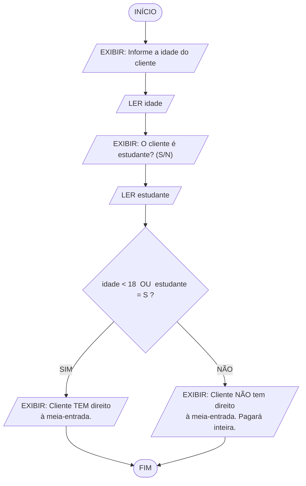
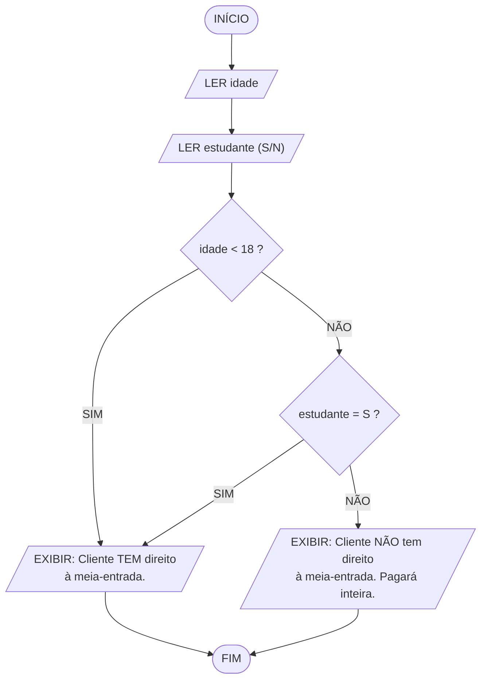

# Bilheteria de Cinema — Verificação de Direito à Meia-Entrada
## Algoritmo em linguagem natural, fluxograma e pseudocódigo

---

## Sumário

1. [Especificação](#1-especificação)
2. [Algoritmo em linguagem natural](#2-algoritmo-em-linguagem-natural)
3. [Fluxograma](#3-fluxograma)
4. [Pseudocódigo — versão direta](#4-pseudocódigo--versão-direta)
5. [Pseudocódigo — versão modularizada](#5-pseudocódigo--versão-modularizada)
6. [Teste de mesa](#6-teste-de-mesa)
7. [Decisões de projeto](#7-decisões-de-projeto)

---

## 1. Especificação

Sistema de bilheteria para um cinema, que avalia as informações do cliente e informa se ele tem ou não direito à meia-entrada.

| Item | Descrição |
|:-----|:----------|
| **Entrada** | A idade do cliente (número inteiro) e a informação de ser ou não estudante (S/N) |
| **Processamento** | Avaliar se **pelo menos uma** das duas condições de meia-entrada é satisfeita |
| **Saída** | Mensagem indicando se o cliente **tem** ou **não tem** direito ao desconto |

### 1.1 Regra de negócio

O cliente tem direito à meia-entrada se:

- tiver **menos de 18 anos**, **ou**
- for **estudante**.

> **Escopo:** conforme o enunciado, o algoritmo se restringe a estas duas condições. Não avalia idosos, professores, dias promocionais nem calcula o valor do ingresso.

### 1.2 Dicionário de variáveis

| Variável | Tipo | Conteúdo |
|:---------|:-----|:---------|
| `idade` | inteiro | Idade do cliente em anos completos |
| `estudante` | caractere | `"S"` se for estudante, `"N"` se não for |
| `temDireito` | lógico | `VERDADEIRO` se o cliente faz jus ao desconto |

---

## 2. Algoritmo em linguagem natural

### Fase 1 — Entrada dos dados

1. **Iniciar** o processo.
2. **Solicitar** a idade do cliente e **armazenar** na variável `idade`.
3. **Validar** a idade: se for negativa ou maior que 120, exibir "Idade inválida. Informe um valor entre 0 e 120." e **voltar ao passo 2**.
4. **Solicitar** se o cliente é estudante, aceitando `S` para sim e `N` para não, e **armazenar** na variável `estudante`.
5. **Padronizar** a resposta para letra maiúscula, de modo que `s` e `S` sejam tratados igualmente.
6. **Validar** a resposta: se não for `S` nem `N`, exibir "Resposta inválida. Digite S ou N." e **voltar ao passo 4**.

### Fase 2 — Avaliação da regra

7. **Verificar as duas condições de desconto**, combinando-as com o operador lógico **OU**:
   - Condição A: a idade é **menor que 18**?
   - Condição B: a resposta sobre ser estudante é igual a **"S"**?
8. **Atribuir** a `temDireito` o resultado de `(Condição A) OU (Condição B)`.
   > O operador **OU** devolve verdadeiro quando **pelo menos uma** das condições é verdadeira. Basta uma delas para garantir o desconto — e satisfazer as duas não dá desconto maior, porque a regra prevê uma única meia-entrada.

### Fase 3 — Saída

9. **Exibir** os dados informados: idade e situação de estudante.
10. **Decidir a mensagem:**
    - **Se** `temDireito` for verdadeiro → exibir **"Cliente TEM direito à meia-entrada."**
    - **Senão** → exibir **"Cliente NÃO tem direito à meia-entrada. Pagará inteira."**
11. **Encerrar** o processo.

### 2.1 Tabela-verdade do operador OU

Esta é a tabela que define todo o comportamento do algoritmo — as quatro combinações possíveis:

| Caso | `idade < 18` | `estudante == "S"` | `A OU B` | Resultado |
|:----:|:------------:|:-----------------:|:--------:|:----------|
| 1 | Falso | Falso | **Falso** | Não tem direito |
| 2 | Falso | Verdadeiro | **Verdadeiro** | Tem direito |
| 3 | Verdadeiro | Falso | **Verdadeiro** | Tem direito |
| 4 | Verdadeiro | Verdadeiro | **Verdadeiro** | Tem direito |

**Três das quatro combinações concedem o desconto.** Somente o caso 1 — adulto e não estudante — paga inteira. Se a regra usasse **E** em vez de **OU**, apenas o caso 4 teria desconto, e o sistema estaria errado.

---

## 3. Fluxograma

### 3.1 Simbologia utilizada (ISO 5807 / ANSI)

| Símbolo | Nome | Função no fluxograma |
|:--------|:-----|:---------------------|
| Retângulo arredondado | **Terminal** | Início e fim do processo |
| Paralelogramo | **Entrada / Saída** | `LER` do teclado e `EXIBIR` na tela |
| Retângulo | **Processo** | Cálculo ou atribuição |
| Losango | **Decisão** | Teste com duas saídas: SIM e NÃO |
| Seta | **Fluxo** | Sentido do processamento |

### 3.2 Fluxograma principal — condição composta

Um único losango contendo a expressão lógica completa:



### 3.3 Fluxograma equivalente — OU expandido em dois losangos

A mesma lógica, com cada condição em seu próprio losango. Repare que **duas setas diferentes chegam ao mesmo bloco de desconto** — é exatamente esse o significado gráfico do operador OU:



> Os dois diagramas produzem resultados idênticos nas quatro combinações da tabela-verdade. A forma expandida tem uma vantagem prática: quando a primeira condição é verdadeira, a segunda nem chega a ser avaliada — é o chamado **curto-circuito**.
>
> Os blocos acima renderizam como fluxogramas gráficos no VS Code, GitHub, Notion e em [mermaid.live](https://mermaid.live).

### 3.4 Fluxograma em texto (com validação de entrada)

```
                        ╭────────────────╮
                        │     INÍCIO     │
                        ╰────────┬───────╯
                                 │
            ┌────────────────────▼────────────────────┐
     ┌─────►│  EXIBIR "Informe a idade do cliente"    /
     │     /   LER idade                              │
     │      └────────────────────┬────────────────────┘
     │                           │
     │                ╱──────────▼──────────╲
     │               ╱  idade >= 0  E         ╲
     │      NÃO     ╱   idade <= 120 ?         ╲     SIM
     │  ┌──────────⟨                            ⟩──────────┐
     │  │           ╲                          ╱           │
     │  │            ╲────────────────────────╱            │
     │  ▼                                                  │
     │ ┌──────────────────────────┐                        │
     └─/  EXIBIR "Idade inválida" │                        │
       └──────────────────────────┘                        │
                                                           │
            ┌──────────────────────────────────────────────┘
            │
            ▼
            ┌────────────────────────────────────────┐
     ┌─────►│  EXIBIR "É estudante? (S/N)"           /
     │     /   LER estudante                         │
     │      │   estudante = MAIÚSCULA(estudante)     │
     │      └────────────────────┬───────────────────┘
     │                           │
     │                ╱──────────▼──────────╲
     │      NÃO      ╱  estudante = "S"  OU  ╲     SIM
     │  ┌───────────⟨   estudante = "N" ?     ⟩──────────┐
     │  │            ╲                       ╱           │
     │  │             ╲─────────────────────╱            │
     │  ▼                                                │
     │ ┌────────────────────────────┐                    │
     └─/  EXIBIR "Digite S ou N"    │                    │
       └────────────────────────────┘                    │
                                                         │
            ┌────────────────────────────────────────────┘
            │
            ▼
   ┌────────────────────────────────────────────┐
   │  temDireito = (idade < 18) OU              │   processo
   │               (estudante = "S")            │   (avaliação lógica)
   └────────────────────┬───────────────────────┘
                        │
             ╱──────────▼──────────╲
            ╱   temDireito é         ╲
   SIM     ╱     VERDADEIRO ?         ╲     NÃO
  ┌───────⟨                            ⟩───────┐
  │        ╲                          ╱        │
  │         ╲────────────────────────╱         │
  ▼                                            ▼
┌───────────────────────────┐   ┌──────────────────────────────────┐
│ EXIBIR                    /   │ EXIBIR                           /
│ "Cliente TEM direito      │   │ "Cliente NÃO tem direito à       │
/  à meia-entrada."         │   /  meia-entrada. Pagará inteira."  │
└─────────────┬─────────────┘   └────────────────┬─────────────────┘
              │                                  │
              └────────────────┬─────────────────┘
                               │
                       ╭───────▼────────╮
                       │      FIM       │
                       ╰────────────────╯
```

---

## 4. Pseudocódigo — versão direta

### Convenção de notação adotada

| Elemento | Símbolo | Exemplo |
|:---------|:--------|:--------|
| Atribuição | **`=`** | `taxaBase = 5,00` |
| Igualdade | **`==`** | `SE (resposta == "S") ENTÃO` |
| Diferença | **`!=`** | `SE (resposta != "S") ENTÃO` |
| Demais comparações | `<` `<=` `>` `>=` | `SE (media < 5) ENTÃO` |
| Estrutura condicional | **`SE ... ENTÃO ... SENÃO ... FIMSE`** | palavras-chave em maiúsculas |
| Separador decimal | **`,`** (vírgula) | `PRECO = 12,00` |
| Separador de argumentos na chamada | **`;`** (ponto e vírgula) | `Subtotal(qtd; preco)` |
| Separador de parâmetros na declaração | **`;`** (ponto e vírgula) | `FUNÇÃO f(a : real ; b : caractere)` |

> **`=` e `==` fazem coisas opostas.** `taxaBase = 5,00` **grava** um valor; `resposta == "S"` **pergunta** se são iguais. Escrever `SE (resposta = "S") ENTÃO` significaria atribuir dentro do teste — a condição perderia a função.
>
> **Por que ponto e vírgula nos argumentos:** a vírgula já é o separador decimal. Se também separasse argumentos, `f(1,5, 2,0)` ficaria ambíguo — dois argumentos ou quatro? Com `f(1,5; 2,0)` a leitura é única.
>
> **Sobre os acentos:** as palavras-chave usam `ENTÃO`, `SENÃO`, `ATÉ`, `INÍCIO`, `FUNÇÃO`, `FAÇA`. Se o interpretador utilizado recusar caracteres acentuados, basta removê-los (`ENTAO`, `SENAO`, `ATE`, `INICIO`, `FUNCAO`, `FACA`) — a lógica não muda.


```
ALGORITMO "CINEMA_VERIFICACAO_MEIA_ENTRADA"

VAR
   idade      : inteiro
   estudante  : caractere
   temDireito : logico

INÍCIO
   ESCREVAL("========================================")
   ESCREVAL("       BILHETERIA - MEIA-ENTRADA        ")
   ESCREVAL("========================================")

   // ============================================================
   // FASE 1 - ENTRADA DA IDADE (com validacao)
   // ============================================================
   REPITA
      ESCREVA("Idade do cliente: ")
      LEIA(idade)

      SE (idade < 0) OU (idade > 120) ENTÃO
         ESCREVAL(">> Idade invalida. Informe um valor entre 0 e 120.")
      FIMSE
   ATÉ (idade >= 0) E (idade <= 120)

   // ============================================================
   // FASE 1b - ENTRADA DA CONDICAO DE ESTUDANTE (com validacao)
   // MAIUSC padroniza a resposta: "s" e "S" sao equivalentes.
   // ============================================================
   REPITA
      ESCREVA("O cliente e estudante? (S/N): ")
      LEIA(estudante)
      estudante = MAIUSC(estudante)

      SE (estudante != "S") E (estudante != "N") ENTÃO
         ESCREVAL(">> Resposta invalida. Digite S ou N.")
      FIMSE
   ATÉ (estudante == "S") OU (estudante == "N")

   // ============================================================
   // FASE 2 - AVALIACAO DA REGRA
   // O operador OU exige que apenas UMA das condicoes seja
   // verdadeira para conceder o desconto.
   // ============================================================
   temDireito = (idade < 18) OU (estudante == "S")

   // ============================================================
   // FASE 3 - SAIDA
   // ============================================================
   ESCREVAL("")
   ESCREVAL("----------------------------------------")
   ESCREVAL("Idade informada .....: "; idade; " anos")
   ESCREVAL("E estudante .........: "; estudante)
   ESCREVAL("----------------------------------------")

   SE (temDireito) ENTÃO
      ESCREVAL("Cliente TEM direito a meia-entrada.")
   SENÃO
      ESCREVAL("Cliente NAO tem direito a meia-entrada.")
      ESCREVAL("Pagara ingresso inteiro.")
   FIMSE

   ESCREVAL("========================================")

FIMALGORITMO
```

### 4.1 Variante sem a variável lógica

O mesmo resultado, testando a expressão diretamente no `SE`:

```
   SE (idade < 18) OU (estudante == "S") ENTÃO
      ESCREVAL("Cliente TEM direito a meia-entrada.")
   SENÃO
      ESCREVAL("Cliente NAO tem direito a meia-entrada.")
   FIMSE
```

Mais curto, mas a versão com `temDireito` é preferível: dá **nome** ao resultado da regra, permitindo reaproveitá-lo depois (para calcular preço, imprimir o ingresso, registrar estatística) sem reescrever a expressão lógica — e sem risco de as duas cópias divergirem no futuro.

---

## 5. Pseudocódigo — versão modularizada

```
ALGORITMO "CINEMA_VERIFICACAO_MEIA_ENTRADA_MODULAR"

VAR
   idade      : inteiro
   estudante  : caractere
   temDireito : logico


// ============================================================
// MODULO 1 - VALIDACAO DA IDADE
// ============================================================
FUNÇÃO IdadeValida(i : inteiro) : logico
INÍCIO
   RETORNE (i >= 0) E (i <= 120)
FIMFUNÇÃO


// ============================================================
// MODULO 2 - LEITURA DA IDADE
// ============================================================
FUNÇÃO LerIdade() : inteiro
VAR
   i : inteiro
INÍCIO
   REPITA
      ESCREVA("Idade do cliente: ")
      LEIA(i)

      SE (NÃO IdadeValida(i)) ENTÃO
         ESCREVAL(">> Idade invalida. Informe um valor entre 0 e 120.")
      FIMSE
   ATÉ IdadeValida(i)

   RETORNE i
FIMFUNÇÃO


// ============================================================
// MODULO 3 - LEITURA DA CONDICAO DE ESTUDANTE
// ============================================================
FUNÇÃO LerEstudante() : caractere
VAR
   r : caractere
INÍCIO
   REPITA
      ESCREVA("O cliente e estudante? (S/N): ")
      LEIA(r)
      r = MAIUSC(r)

      SE (r != "S") E (r != "N") ENTÃO
         ESCREVAL(">> Resposta invalida. Digite S ou N.")
      FIMSE
   ATÉ (r == "S") OU (r == "N")

   RETORNE r
FIMFUNÇÃO


// ============================================================
// MODULO 4 - REGRA DE NEGOCIO
// Unico ponto do sistema que conhece as condicoes de desconto.
// Funcao pura: mesma entrada, mesma saida, sem efeito colateral.
// ============================================================
FUNÇÃO TemDireitoMeiaEntrada(i : inteiro ; e : caractere) : logico
INÍCIO
   RETORNE (i < 18) OU (e == "S")
FIMFUNÇÃO


// ============================================================
// MODULO 5 - SAIDA
// ============================================================
PROCEDIMENTO ExibirResultado(i : inteiro ; e : caractere ; direito : logico)
INÍCIO
   ESCREVAL("")
   ESCREVAL("----------------------------------------")
   ESCREVAL("Idade informada .....: "; i; " anos")
   ESCREVAL("E estudante .........: "; e)
   ESCREVAL("----------------------------------------")

   SE (direito) ENTÃO
      ESCREVAL("Cliente TEM direito a meia-entrada.")
   SENÃO
      ESCREVAL("Cliente NAO tem direito a meia-entrada.")
      ESCREVAL("Pagara ingresso inteiro.")
   FIMSE

   ESCREVAL("========================================")
FIMPROCEDIMENTO


// ============================================================
// PROGRAMA PRINCIPAL
// ============================================================
INÍCIO
   ESCREVAL("========================================")
   ESCREVAL("       BILHETERIA - MEIA-ENTRADA        ")
   ESCREVAL("========================================")

   idade      = LerIdade()
   estudante  = LerEstudante()
   temDireito = TemDireitoMeiaEntrada(idade; estudante)

   ExibirResultado(idade; estudante; temDireito)

FIMALGORITMO
```

### 5.1 Catálogo de módulos

| Módulo | Tipo | Parâmetros | Retorno | Responsabilidade |
|:-------|:-----|:-----------|:--------|:-----------------|
| `IdadeValida` | Função | `i: inteiro` | `logico` | Aceita idades de 0 a 120 |
| `LerIdade` | Função | — | `inteiro` | Lê insistindo até obter idade válida |
| `LerEstudante` | Função | — | `caractere` | Lê e padroniza a resposta S/N |
| `TemDireitoMeiaEntrada` | Função | `i`, `e` | `logico` | **Aplica a regra `(i < 18) OU (e == "S")`** |
| `ExibirResultado` | Procedimento | `i`, `e`, `direito` | — | Monta a mensagem final |

### 5.2 Hierarquia de chamadas

```
PROGRAMA PRINCIPAL
│
├── LerIdade()
│   └── IdadeValida(i)
│
├── LerEstudante()
│
├── TemDireitoMeiaEntrada(idade; estudante)
│
└── ExibirResultado(idade; estudante; temDireito)
```

---

## 6. Teste de mesa

| # | `idade` | `estudante` | `idade < 18` | `estudante == "S"` | `temDireito` | Mensagem exibida |
|:-:|--------:|:-----------:|:------------:|:-----------------:|:------------:|:-----------------|
| 1 | 15 | N | **V** | F | **V** | TEM direito à meia-entrada |
| 2 | 25 | S | F | **V** | **V** | TEM direito à meia-entrada |
| 3 | 30 | N | F | F | **F** | NÃO tem direito — paga inteira |
| 4 | 17 | S | **V** | **V** | **V** | TEM direito à meia-entrada |
| 5 | **17** | N | **V** | F | **V** | TEM direito à meia-entrada |
| 6 | **18** | N | F | F | **F** | NÃO tem direito — paga inteira |
| 7 | **18** | S | F | **V** | **V** | TEM direito à meia-entrada |
| 8 | 0 | N | **V** | F | **V** | TEM direito à meia-entrada |
| 9 | −5 | — | *rejeitado por `IdadeValida`* | — | — | Idade inválida (relê) |
| 10 | 40 | X | — | *rejeitado por `LerEstudante`* | — | Resposta inválida (relê) |

Os casos **5, 6 e 7** são a fronteira crítica: com 17 anos há direito mesmo sem ser estudante; com 18 anos, o direito **depende exclusivamente** de ser estudante.

### 6.1 Cobertura da tabela-verdade

| Caso da tabela-verdade | Coberto pelos testes |
|:-----------------------|:---------------------|
| 1 — Falso / Falso | # 3, # 6 |
| 2 — Falso / Verdadeiro | # 2, # 7 |
| 3 — Verdadeiro / Falso | # 1, # 5, # 8 |
| 4 — Verdadeiro / Verdadeiro | # 4 |

As quatro combinações possíveis do operador OU estão exercitadas — o teste de mesa é exaustivo em relação à regra.

---

## 7. Decisões de projeto

- **`OU`, não `E`.** É o núcleo do exercício. As condições são **alternativas**, não cumulativas: basta uma para conceder o desconto. Trocar por `E` reduziria o benefício apenas a menores de 18 que também fossem estudantes — três dos quatro casos da tabela-verdade seriam classificados errado.

- **`idade < 18`, não `idade <= 18`.** "Menos de 18 anos" exclui quem já completou 18. Alguém com exatamente 18 anos só tem direito se for estudante — o caso 6 do teste de mesa comprova, e o caso 7 mostra a diferença.

- **A regra em uma função de nome próprio.** `TemDireitoMeiaEntrada` é o único ponto do sistema que conhece as condições. Se a lei mudar a idade-limite para 16, ou incluir uma terceira hipótese, altera-se uma linha — e o resto do algoritmo continua válido. É também o módulo que se testa isoladamente contra a tabela-verdade.

- **Resposta padronizada com `MAIUSC`.** Sem isso, um cliente que digitasse `s` minúsculo seria classificado como não estudante — um erro silencioso, que não gera mensagem de falha e passa despercebido na bilheteria.

- **Validação separada da regra.** `LerIdade` e `LerEstudante` garantem que a regra receba apenas dados coerentes. `TemDireitoMeiaEntrada` não precisa se defender de idade negativa ou de resposta inválida, o que a mantém com uma única linha e uma única responsabilidade.

- **`REPITA ... ATÉ` para as entradas.** O laço pós-testado é o adequado para leitura validada, porque a entrada precisa acontecer **pelo menos uma vez** antes que haja o que validar.

- **Uma decisão, duas saídas, um fim.** O `SE/SENÃO` final é exaustivo e mutuamente exclusivo: todo cliente recebe exatamente uma mensagem, e ambos os caminhos convergem para o mesmo terminal FIM.

- **Escopo respeitado.** O algoritmo apenas informa se há ou não direito, como o enunciado determina. Não calcula preço, não aplica percentual, não pede comprovante — essas seriam extensões posteriores, encaixadas depois de `TemDireitoMeiaEntrada` sem alterar a regra.
