# Classificando Desempenho Acadêmico
## Algoritmo em linguagem natural, pseudocódigo e fluxograma

---

## Sumário

1. [Enunciado e regra de negócio](#1-enunciado-e-regra-de-negócio)
2. [Algoritmo em linguagem natural](#2-algoritmo-em-linguagem-natural)
3. [Fluxograma](#3-fluxograma)
4. [Pseudocódigo — versão direta](#4-pseudocódigo--versão-direta)
5. [Pseudocódigo — versão modularizada](#5-pseudocódigo--versão-modularizada)
6. [Teste de mesa](#6-teste-de-mesa)
7. [Justificativas de projeto](#7-justificativas-de-projeto)

---

## 1. Enunciado e regra de negócio

Sistema educacional que exibe mensagens personalizadas para estudantes com base em sua média final.

### Especificação de entrada, processamento e saída

| Item | Descrição |
|:-----|:----------|
| **Entrada** | A média final do estudante (número real, de 0,0 a 10,0) |
| **Processamento** | Comparar a média com as faixas definidas pela equipe pedagógica |
| **Saída** | Uma única mensagem de situação, correspondente à faixa em que a média se encaixa |

### Regra de negócio definida pela equipe pedagógica

| Faixa da média | Situação | Mensagem exibida |
|:---------------|:---------|:-----------------|
| Menor que 5,0 | Reprovado | "Você está reprovado." |
| De 5,0 até menos de 7,0 | Recuperação | "Você está de recuperação." |
| 7,0 ou mais | Aprovado | "Parabéns! Você foi aprovado." |

---

## 2. Algoritmo em linguagem natural

### Passo a passo

1. **Iniciar** o processo.

2. **Solicitar** ao estudante (ou ao operador do sistema) que informe a **média final**.

3. **Ler e armazenar** o valor informado em uma variável chamada `media`.

4. **Validar** o valor lido:
   - **Se** `media` for menor que 0,0 **ou** maior que 10,0, **então** exibir a mensagem "Média inválida. Informe um valor entre 0,0 e 10,0." e **voltar ao passo 2**.
   - **Senão**, seguir para o passo 5.

5. **Verificar a primeira condição:** a média é menor que 5,0?
   - **Se sim (verdadeiro)** → exibir a mensagem **"Você está reprovado."** e **seguir direto para o passo 8**. Nenhuma outra verificação é feita.
   - **Se não (falso)** → seguir para o passo 6.

6. **Verificar a segunda condição:** a média é menor que 7,0?
   > Neste ponto já se sabe, pelo passo 5, que a média é **maior ou igual a 5,0**. Portanto, esta única comparação já delimita a faixa completa de 5,0 até menos de 7,0 — não é necessário testar o limite inferior novamente.
   - **Se sim (verdadeiro)** → exibir a mensagem **"Você está de recuperação."** e **seguir direto para o passo 8**.
   - **Se não (falso)** → seguir para o passo 7.

7. **Caso contrário (situação remanescente):** a média é necessariamente **maior ou igual a 7,0**, pois todas as faixas inferiores já foram descartadas nos passos 5 e 6. Exibir a mensagem **"Parabéns! Você foi aprovado."**

8. **Encerrar** o processo.

### Por que a decisão é encadeada

A escolha é uma condicional **encadeada** (`SE` / `SENÃOSE` / `SENÃO`), e não três condicionais independentes:

- **Exclusividade mútua** — assim que uma condição é satisfeita, o fluxo salta para o fim. É impossível o estudante receber duas mensagens contraditórias.
- **Economia de comparações** — uma média de 3,0 exige **uma** comparação; uma média de 9,0 exige **duas**. Com condicionais independentes, as três seriam sempre avaliadas.
- **Simplificação dos testes** — como o encadeamento garante que a faixa inferior já foi descartada, o teste do meio não precisa ser `media >= 5,0 E media < 7,0`; basta `media < 7,0`. Cada condição só verifica o **limite superior** da sua faixa.
- **O `SENÃO` final não tem condição** — ele captura tudo o que sobrou. Isso torna o algoritmo **exaustivo por construção**: nenhuma média válida pode "escapar" sem receber mensagem.

---

## 3. Fluxograma

### 3.1 Simbologia utilizada (ISO 5807 / ANSI)

| Símbolo | Nome | Função no fluxograma |
|:--------|:-----|:---------------------|
| Retângulo arredondado | **Terminal** | Início e fim do processo |
| Paralelogramo | **Entrada / Saída** | `LER` do teclado e `ESCREVER` na tela |
| Retângulo | **Processo** | Cálculo ou atribuição |
| Losango | **Decisão** | Teste com duas saídas: SIM e NÃO |
| Seta | **Fluxo** | Sentido do processamento |

### 3.2 Diagrama renderizável (Mermaid)

```mermaid
flowchart TD
    A([INÍCIO]) --> B[/"ESCREVER: Informe a média final (0,0 a 10,0)"/]
    B --> C[/"LER media"/]
    C --> D{"média ≥ 0,0  E  média ≤ 10,0 ?"}

    D -- NÃO --> E[/"ESCREVER: Média inválida. Informe entre 0 e 10."/]
    E --> B

    D -- SIM --> F{"média < 5,0 ?"}

    F -- SIM --> G[/"ESCREVER: Você está reprovado."/]
    F -- NÃO --> H{"média < 7,0 ?"}

    H -- SIM --> I[/"ESCREVER: Você está de recuperação."/]
    H -- NÃO --> J[/"ESCREVER: Parabéns! Você foi aprovado."/]

    G --> K([FIM])
    I --> K
    J --> K
```



> O bloco acima renderiza como fluxograma gráfico no GitHub, VS Code, Notion, Obsidian e em [mermaid.live](https://mermaid.live).

**Correspondência dos símbolos no Mermaid:**

| Notação | Símbolo gerado | Uso |
|:--------|:---------------|:----|
| `([texto])` | Retângulo arredondado | Terminal (INÍCIO / FIM) |
| `[/texto/]` | Paralelogramo | Entrada e saída (`LER` / `ESCREVER`) |
| `{texto}` | Losango | Decisão |
| `-- NÃO -->` | Seta rotulada | Saída da decisão |

### 3.3 Diagrama em texto (com validação de entrada)

```
                              ╭────────────────╮
                              │     INÍCIO     │
                              ╰────────┬───────╯
                                       │
                ┌──────────────────────▼──────────────────────┐
        ┌──────►│  ESCREVER  "Informe a média final           /
        │      /              (0,0 a 10,0)"                   │
        │       └──────────────────────┬──────────────────────┘
        │                              │
        │       ┌──────────────────────▼──────────────────────┐
        │      /   LER  media                                 │
        │       └──────────────────────┬──────────────────────┘
        │                              │
        │                   ╱──────────▼──────────╲
        │                  ╱   media >= 0,0   E    ╲
        │        NÃO      ╱    media <= 10,0  ?     ╲      SIM
        │  ┌─────────────⟨                           ⟩─────────────┐
        │  │              ╲                         ╱              │
        │  │               ╲───────────────────────╱               │
        │  ▼                                                       │
        │ ┌─────────────────────────────────────┐                  │
        │ │  ESCREVER  "Média inválida.         /                  │
        └─/             Informe entre 0 e 10."  │                  │
          └─────────────────────────────────────┘                  │
                                                                   │
                                        ╱──────────────────╲◄──────┘
                                       ╱                    ╲
                             SIM      ╱   media < 5,0  ?     ╲      NÃO
                       ┌─────────────⟨                        ⟩─────────────┐
                       │              ╲                      ╱              │
                       │               ╲────────────────────╱               │
                       ▼                                                    │
        ┌──────────────────────────┐                        ╱───────────────▼───────╲
        │  ESCREVER                /                       ╱                         ╲
       /   "Você está reprovado."  │             SIM      ╱     media < 7,0  ?        ╲     NÃO
        └────────────┬─────────────┘        ┌────────────⟨                             ⟩────────────┐
                     │                      │             ╲                           ╱             │
                     │                      │              ╲─────────────────────────╱              │
                     │                      ▼                                                       ▼
                     │       ┌──────────────────────────────┐               ┌──────────────────────────────┐
                     │       │  ESCREVER                    /               │  ESCREVER                    /
                     │      /   "Você está de recuperação." │              /   "Parabéns! Você foi         │
                     │       └──────────────┬───────────────┘               /    aprovado."                │
                     │                      │                               └──────────────┬───────────────┘
                     │                      │                                              │
                     └──────────────────────┴───────────────┬──────────────────────────────┘
                                                            │
                                                    ╭───────▼────────╮
                                                    │      FIM       │
                                                    ╰────────────────╯
```

### 3.4 Diagrama essencial (somente a regra de negócio)

Versão reduzida, cobrindo apenas o que o enunciado exige — sem o laço de validação:

```
        ╭──────────────╮
        │    INÍCIO    │
        ╰──────┬───────╯
               │
    ┌──────────▼──────────┐
   /   LER  media         │
    └──────────┬──────────┘
               │
      ╱────────▼────────╲
     ╱  media < 5,0  ?   ╲
    ⟨                     ⟩───── SIM ─────┐
     ╲                   ╱                │
      ╲─────────────────╱                 ▼
               │             ┌───────────────────────────┐
              NÃO           /  ESCREVER                  │
               │             │  "Você está reprovado."   │
      ╱────────▼────────╲    └─────────────┬─────────────┘
     ╱  media < 7,0  ?   ╲                 │
    ⟨                     ⟩───── SIM ──┐   │
     ╲                   ╱             │   │
      ╲─────────────────╱              ▼   │
               │            ┌──────────────────────────────┐
              NÃO          /  ESCREVER                     │
               │           │  "Você está de recuperação."  │
    ┌──────────▼────────┐  └─────────────┬────────────────┘
   /  ESCREVER          │                │
    │  "Parabéns! Você  │                │
   /   foi aprovado."   │                │
    └──────────┬────────┘                │
               │                         │
               └───────────┬─────────────┘
                           │
                   ╭───────▼────────╮
                   │      FIM       │
                   ╰────────────────╯
```

### 3.5 Leitura do fluxograma

- **Um único ponto de entrada e um único ponto de saída.** Todos os três caminhos convergem para o mesmo terminal FIM, o que caracteriza um algoritmo estruturado — sem desvios incondicionais.
- **O laço de validação é o único retorno para trás.** A seta que sai de "Média inválida" volta ao símbolo de `ESCREVER` do prompt, reproduzindo graficamente o `REPITA ... ATÉ` do pseudocódigo. É o único ciclo do diagrama.
- **Os losangos são atravessados em cascata, nunca em paralelo.** O segundo teste (`média < 7,0`) só é alcançado pela saída **NÃO** do primeiro. É essa dependência que garante, sem escrever `média ≥ 5,0` em lugar nenhum, que quem chega ao segundo losango já tem média igual ou superior a 5,0.
- **O caminho mais curto tem um losango; o mais longo tem dois.** Uma média 3,0 sai na primeira decisão; uma média 9,0 percorre as duas. Nenhuma média percorre três.
- **Não existe caminho sem saída.** Cada losango tem obrigatoriamente as duas saídas preenchidas (SIM e NÃO), e ambas terminam em um símbolo de saída. Essa é a verificação visual de que o algoritmo é exaustivo — nenhuma média válida fica sem mensagem.

---

## 4. Pseudocódigo — versão direta

### Convenção de notação adotada

| Elemento | Símbolo | Exemplo |
|:---------|:--------|:--------|
| Atribuição | **`=`** | `taxaBase = 5,00` |
| Igualdade | **`==`** | `SE (resposta == "S") ENTÃO` |
| Diferença | **`!=`** | `SE (resposta != "S") ENTÃO` |
| Demais comparações | `<` `<=` `>` `>=` | `SE (media < 5) ENTÃO` |
| Estrutura condicional | **`SE ... ENTÃO ... SENÃO ... FIMSE`** | palavras-chave em maiúsculas |
| Separador decimal | **`,`** (vírgula) | `PRECO = 12,00` |
| Separador de argumentos na chamada | **`;`** (ponto e vírgula) | `Subtotal(qtd; preco)` |
| Separador de parâmetros na declaração | **`;`** (ponto e vírgula) | `FUNÇÃO f(a : real ; b : caractere)` |

> **`=` e `==` fazem coisas opostas.** `taxaBase = 5,00` **grava** um valor; `resposta == "S"` **pergunta** se são iguais. Escrever `SE (resposta = "S") ENTÃO` significaria atribuir dentro do teste — a condição perderia a função.
>
> **Por que ponto e vírgula nos argumentos:** a vírgula já é o separador decimal. Se também separasse argumentos, `f(1,5, 2,0)` ficaria ambíguo — dois argumentos ou quatro? Com `f(1,5; 2,0)` a leitura é única.
>
> **Sobre os acentos:** as palavras-chave usam `ENTÃO`, `SENÃO`, `ATÉ`, `INÍCIO`, `FUNÇÃO`, `FAÇA`. Se o interpretador utilizado recusar caracteres acentuados, basta removê-los (`ENTAO`, `SENAO`, `ATE`, `INICIO`, `FUNCAO`, `FACA`) — a lógica não muda.


```
ALGORITMO "CLASSIFICACAO_DESEMPENHO_ACADEMICO"

VAR
   media : real

INÍCIO
   // ---------- ENTRADA E VALIDACAO ----------
   REPITA
      ESCREVA("Informe a media final (0,0 a 10,0): ")
      LEIA(media)

      SE (media < 0) OU (media > 10) ENTÃO
         ESCREVAL(">> Media invalida. Informe um valor entre 0,0 e 10,0.")
         ESCREVAL("")
      FIMSE
   ATÉ (media >= 0) E (media <= 10)

   // ---------- DECISAO ENCADEADA ----------
   ESCREVAL("")
   ESCREVAL("=== RESULTADO ===")
   ESCREVAL("Media final: "; media:0:1)

   SE (media < 5) ENTÃO
      ESCREVAL("Voce esta reprovado.")
   SENÃO
      SE (media < 7) ENTÃO                 // aqui ja se sabe que media >= 5
         ESCREVAL("Voce esta de recuperacao.")
      SENÃO                                // resta apenas media >= 7
         ESCREVAL("Parabens! Voce foi aprovado.")
      FIMSE
   FIMSE

FIMALGORITMO
```

### Variante com `SENÃOSE`

Interpretadores que aceitam a cláusula `SENÃOSE` permitem escrever a mesma decisão sem aninhamento, deixando as três faixas visualmente no mesmo nível:

```
   SE (media < 5) ENTÃO
      ESCREVAL("Voce esta reprovado.")
   SENÃOSE (media < 7) ENTÃO
      ESCREVAL("Voce esta de recuperacao.")
   SENÃO
      ESCREVAL("Parabens! Voce foi aprovado.")
   FIMSE
```

Os dois trechos são **logicamente idênticos** — `SENÃOSE` é apenas açúcar sintático para o `SE` aninhado dentro do `SENÃO`. O VisuAlg clássico não reconhece `SENÃOSE`, então a primeira forma é a mais portável.

---

## 5. Pseudocódigo — versão modularizada

Separa as três responsabilidades — obter o dado, decidir a situação, exibir o resultado — em módulos independentes.

```
ALGORITMO "CLASSIFICACAO_DESEMPENHO_ACADEMICO_MODULAR"

VAR
   media : real
   situacao : caractere


// ============================================================
// MODULO 1 - VALIDACAO DA MEDIA
// ============================================================
FUNÇÃO MediaValida(m : real) : logico
INÍCIO
   RETORNE (m >= 0) E (m <= 10)
FIMFUNÇÃO


// ============================================================
// MODULO 2 - ENTRADA COM VALIDACAO
// Insiste ate receber um valor dentro da escala 0,0 a 10,0.
// ============================================================
FUNÇÃO LerMedia() : real
VAR
   m : real
INÍCIO
   REPITA
      ESCREVA("Informe a media final (0,0 a 10,0): ")
      LEIA(m)

      SE (NÃO MediaValida(m)) ENTÃO
         ESCREVAL(">> Media invalida. Informe um valor entre 0,0 e 10,0.")
         ESCREVAL("")
      FIMSE
   ATÉ MediaValida(m)

   RETORNE m
FIMFUNÇÃO


// ============================================================
// MODULO 3 - REGRA DE NEGOCIO (decisao encadeada)
// Unico ponto do algoritmo que conhece as notas de corte.
// ============================================================
FUNÇÃO ClassificarDesempenho(m : real) : caractere
INÍCIO
   SE (m < 5) ENTÃO
      RETORNE "REPROVADO"
   FIMSE

   SE (m < 7) ENTÃO                        // aqui ja se sabe que m >= 5
      RETORNE "RECUPERACAO"
   FIMSE

   RETORNE "APROVADO"                      // resta apenas m >= 7
FIMFUNÇÃO


// ============================================================
// MODULO 4 - MENSAGEM CORRESPONDENTE A SITUACAO
// Separar texto de regra permite mudar a redacao das
// mensagens sem tocar nas notas de corte.
// ============================================================
FUNÇÃO MensagemDe(s : caractere) : caractere
INÍCIO
   SE (s == "REPROVADO") ENTÃO
      RETORNE "Voce esta reprovado."
   FIMSE

   SE (s == "RECUPERACAO") ENTÃO
      RETORNE "Voce esta de recuperacao."
   FIMSE

   RETORNE "Parabens! Voce foi aprovado."
FIMFUNÇÃO


// ============================================================
// MODULO 5 - SAIDA
// ============================================================
PROCEDIMENTO ExibirResultado(m : real ; s : caractere)
INÍCIO
   ESCREVAL("")
   ESCREVAL("=== RESULTADO ===")
   ESCREVAL("Media final : "; m:0:1)
   ESCREVAL("Situacao    : "; s)
   ESCREVAL(MensagemDe(s))
FIMPROCEDIMENTO


// ============================================================
// PROGRAMA PRINCIPAL
// ============================================================
INÍCIO
   media    = LerMedia()
   situacao = ClassificarDesempenho(media)
   ExibirResultado(media; situacao)

FIMALGORITMO
```

### Catálogo de módulos

| Módulo | Tipo | Parâmetros | Retorno | Responsabilidade |
|:-------|:-----|:-----------|:--------|:-----------------|
| `MediaValida` | Função | `m: real` | `logico` | Verifica se a média está na escala 0,0 a 10,0 |
| `LerMedia` | Função | — | `real` | Lê do teclado insistindo até obter valor válido |
| `ClassificarDesempenho` | Função | `m: real` | `caractere` | Aplica a decisão encadeada e devolve o código da situação |
| `MensagemDe` | Função | `s: caractere` | `caractere` | Traduz o código da situação na frase exibida |
| `ExibirResultado` | Procedimento | `m: real`, `s: caractere` | — | Monta e imprime o bloco de resultado |

---

## 6. Teste de mesa

| Média lida | `m < 5` | `m < 7` | Retorno de `ClassificarDesempenho` | Mensagem exibida |
|-----------:|:--------|:--------|:-----------------------------------|:-----------------|
| 0,0 | V | — | REPROVADO | Você está reprovado. |
| 4,9 | V | — | REPROVADO | Você está reprovado. |
| **4,99** | V | — | REPROVADO | Você está reprovado. |
| **5,0** | F | V | RECUPERACAO | Você está de recuperação. |
| 6,0 | F | V | RECUPERACAO | Você está de recuperação. |
| 6,9 | F | V | RECUPERACAO | Você está de recuperação. |
| **6,99** | F | V | RECUPERACAO | Você está de recuperação. |
| **7,0** | F | F | APROVADO | Parabéns! Você foi aprovado. |
| 8,5 | F | F | APROVADO | Parabéns! Você foi aprovado. |
| 10,0 | F | F | APROVADO | Parabéns! Você foi aprovado. |
| −1,0 | *rejeitado por `MediaValida`* | — | — | Média inválida (relê) |
| 11,0 | *rejeitado por `MediaValida`* | — | — | Média inválida (relê) |

As linhas em **negrito** são os casos de fronteira — os que efetivamente comprovam que as faixas são contíguas e que os limites 5,0 e 7,0 pertencem à faixa superior.

---

## 7. Justificativas de projeto

### 7.1 Observação sobre a redação da regra

O enunciado descreve a faixa intermediária como "**média entre 5,0 e 6,9**". Lido ao pé da letra, isso deixaria as médias de **6,91 a 6,99 sem classificação** — não seriam recuperação (passam de 6,9) nem aprovação (não chegam a 7,0).

O algoritmo adota a leitura pedagógica correta: a faixa intermediária vai de **5,0 até qualquer valor abaixo de 7,0**. Por isso o teste é `media < 7,0`, e não `media <= 6,9`. Assim, as três faixas ficam **contíguas e sem lacunas**, cobrindo toda a escala de 0,0 a 10,0.

O mesmo cuidado vale para as fronteiras exatas: **5,0 é recuperação** (não reprovação) e **7,0 é aprovação** (não recuperação), conforme o "5,0 ou mais" e o "7,0 ou mais" implícitos na regra.

### 7.2 Pontos de atenção na codificação

- **Retornos antecipados dispensam o `SENÃO`.** Em `ClassificarDesempenho`, cada `RETORNE` encerra a função na hora. Por isso os três testes ficam sequenciais e ainda assim mutuamente exclusivos — o segundo `SE` só é alcançado quando o primeiro foi falso. O efeito é o mesmo do encadeamento `SE/SENÃO`, com menos aninhamento.
- **O limite inferior nunca é testado duas vezes.** O segundo teste é `m < 7`, e não `m >= 5 E m < 7`. A condição `m >= 5` já está garantida pelo fato de o primeiro teste ter falhado — repeti-la seria redundante e abriria espaço para inconsistência caso uma das notas de corte mudasse no futuro.
- **Comparação `< 7` em vez de `<= 6,9`.** Esta é a decisão que fecha a lacuna dos valores entre 6,91 e 6,99. Com `<= 6,9`, uma média de 6,95 cairia no `SENÃO` final e seria classificada indevidamente como aprovada.
- **`REPITA ... ATÉ` para a entrada.** O laço pós-testado é o adequado aqui porque a leitura precisa acontecer **pelo menos uma vez** antes de qualquer validação — diferente do `ENQUANTO`, que testaria uma variável ainda não preenchida.
- **Situação e mensagem separadas.** `ClassificarDesempenho` devolve um código (`"APROVADO"`), não o texto final. Isso permite reaproveitar a classificação para outros fins — gravar em boletim, contar alunos por situação, aplicar cor na tela — sem depender da redação da frase.
- **Formatação `media:0:1`** exibe a média com uma casa decimal (7,0 em vez de 7). Sem isso, o VisuAlg imprime reais em notação estendida, o que polui a saída.

### 7.3 Extensão natural

Como `ClassificarDesempenho` é uma função pura que recebe uma média e devolve um código, o algoritmo se estende para **uma turma inteira** sem alterar a regra de negócio: basta envolver a leitura num laço com sentinela e acumular contadores por situação — a mesma estrutura usada no algoritmo de controle financeiro pessoal.
