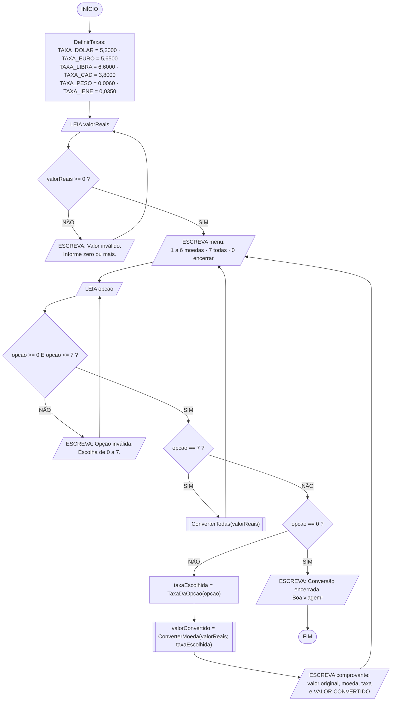
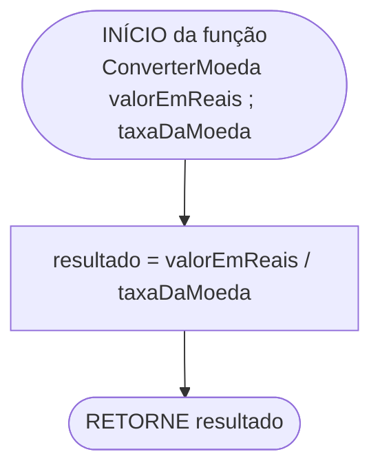
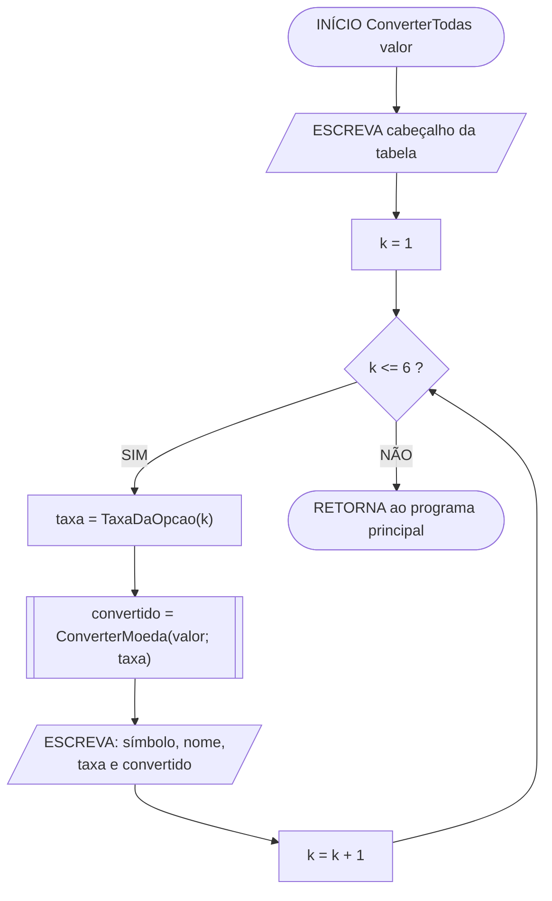

# Conversor de Moedas — Agência de Viagens
## Algoritmo em linguagem natural, fluxograma e pseudocódigo

---

## Sumário

1. [Especificação](#1-especificação)
2. [A função de conversão — o coração do algoritmo](#2-a-função-de-conversão--o-coração-do-algoritmo)
3. [Algoritmo em linguagem natural](#3-algoritmo-em-linguagem-natural)
4. [Fluxograma](#4-fluxograma)
5. [Convenção de notação adotada](#5-convenção-de-notação-adotada)
6. [Pseudocódigo — versão direta](#6-pseudocódigo--versão-direta)
7. [Pseudocódigo — versão modularizada](#7-pseudocódigo--versão-modularizada)
8. [Teste de mesa e exemplo de execução](#8-teste-de-mesa-e-exemplo-de-execução)
9. [Comparação das versões](#9-comparação-das-versões)
10. [Decisões de projeto](#10-decisões-de-projeto)

---

## 1. Especificação

Sistema de apoio para uma agência de viagens. O cliente informa um valor em reais (R$) e o sistema mostra quanto isso representa em outras moedas, usando taxas de câmbio definidas pela empresa.

| Item | Descrição |
|:-----|:----------|
| **Entrada** | O valor em reais (R$) e a moeda de destino escolhida no menu |
| **Processamento** | Chamar **uma única função** de conversão, passando o valor e a taxa da moeda escolhida |
| **Saída** | O valor convertido, com o símbolo e o nome da moeda de destino |

### 1.1 Tabela de câmbio da empresa

Taxas definidas pela agência — quantos **reais** custa **uma unidade** de cada moeda:

| Opção | Moeda | Símbolo | Taxa (R$ por 1 unidade) |
|:-----:|:------|:-------:|------------------------:|
| 1 | Dólar americano | US$ | 5,2000 |
| 2 | Euro | EUR | 5,6500 |
| 3 | Libra esterlina | GBP | 6,6000 |
| 4 | Dólar canadense | CAD | 3,8000 |
| 5 | Peso argentino | AR$ | 0,0060 |
| 6 | Iene japonês | JPY | 0,0350 |
| 7 | *Converter para todas as moedas* | — | — |
| 0 | *Encerrar* | — | — |

> Valores ilustrativos, fixados pela agência. Não são cotações de mercado em tempo real.
>
> Os símbolos `€`, `£` e `¥` foram substituídos pelos códigos ISO `EUR`, `GBP` e `JPY` nos literais do pseudocódigo, para não depender do suporte a Unicode do console.

### 1.2 Dicionário de variáveis

**Constantes de câmbio** (carregadas uma vez, no início):

| Variável | Tipo | Valor |
|:---------|:-----|------:|
| `TAXA_DOLAR` | real | 5,2000 |
| `TAXA_EURO` | real | 5,6500 |
| `TAXA_LIBRA` | real | 6,6000 |
| `TAXA_CAD` | real | 3,8000 |
| `TAXA_PESO` | real | 0,0060 |
| `TAXA_IENE` | real | 0,0350 |

**Variáveis de trabalho:**

| Variável | Tipo | Conteúdo |
|:---------|:-----|:---------|
| `valorReais` | real | Valor informado pelo cliente, em R$ |
| `opcao` | inteiro | Item escolhido no menu (0 a 7) |
| `taxaEscolhida` | real | Taxa correspondente à moeda selecionada |
| `nomeMoeda` | caractere | Nome da moeda escolhida, para exibição |
| `simboloMoeda` | caractere | Símbolo da moeda escolhida, para exibição |
| `valorConvertido` | real | Resultado devolvido pela função |

---

## 2. A função de conversão — o coração do algoritmo

### 2.1 Contrato

| Aspecto | Definição |
|:--------|:----------|
| **Nome** | `ConverterMoeda` |
| **Parâmetro 1** | `valorEmReais` (real) — quantia em R$ a ser convertida |
| **Parâmetro 2** | `taxaDaMoeda` (real) — quantos reais custa 1 unidade da moeda de destino |
| **Retorno** | real — a quantia equivalente na moeda de destino |
| **Cálculo** | `valorEmReais / taxaDaMoeda` |
| **Pré-condição** | `taxaDaMoeda` deve ser **maior que zero** |
| **Efeito colateral** | Nenhum — a função apenas lê os parâmetros e devolve o resultado |

### 2.2 Por que uma função só, e não seis

A função **não sabe** qual moeda está convertendo, e é justamente isso que a torna reutilizável. Ela recebe um número e uma taxa, e devolve outro número. Quem decide *qual* taxa passar é o programa principal, a partir da escolha do cliente.

```
ConverterMoeda(1000,00; 5,2000)   ->   192,31    (dólar)
ConverterMoeda(1000,00; 5,6500)   ->   176,99    (euro)
ConverterMoeda(1000,00; 6,6000)   ->   151,52    (libra)
```

Três moedas, três resultados, **uma única função**. Acrescentar o franco suíço amanhã não exige escrever `ConverterParaFranco` — exige apenas acrescentar uma taxa à tabela e uma linha ao menu. A regra de cálculo permanece intocada.

### 2.3 Por que dividir, e não multiplicar

Este é o ponto em que a maioria dos conversores erra. A taxa está expressa como **"quantos reais valem 1 unidade da moeda estrangeira"** — é assim que se cotam moedas no Brasil ("o dólar está a R$ 5,20"). Nesse formato:

| Operação | Conta | Resultado | Faz sentido? |
|:---------|:------|----------:|:-------------|
| **Divisão** (correta) | 1.000,00 / 5,2000 | US$ 192,31 | ✅ Menos dólares que reais — o dólar vale mais |
| Multiplicação (errada) | 1.000,00 × 5,2000 | US$ 5.200,00 | ❌ R$ 1.000 virariam US$ 5.200 |

A verificação mental é simples: **se a moeda de destino vale mais que o real, o número tem que diminuir.** Com o peso argentino (taxa 0,0060, ou seja, vale menos que o real), acontece o oposto — R$ 1.000,00 viram AR$ 166.666,67, e o número aumenta. A divisão acerta os dois casos; a multiplicação erra os dois.

> A convenção inversa também é válida: guardar a taxa como "quantas unidades da moeda se compra com 1 real" (0,1923 para o dólar) e **multiplicar**. As duas funcionam, desde que a tabela e a fórmula sejam coerentes entre si. O erro fatal é misturar as duas — usar taxa de um formato com a operação do outro.

---

## 3. Algoritmo em linguagem natural

### Fase 1 — Definição da função de conversão

1. **Definir** a função `ConverterMoeda`, que recebe dois valores de entrada — `valorEmReais` e `taxaDaMoeda` — e devolve um valor de saída:
   1. **Calcular** a divisão de `valorEmReais` por `taxaDaMoeda`.
   2. **Devolver** esse resultado a quem chamou a função.
   > A função não lê nada do teclado nem escreve nada na tela. Ela só calcula e devolve. É essa característica que permite reutilizá-la em qualquer contexto — inclusive dentro de um laço que converte para várias moedas de uma vez.

### Fase 2 — Carga da tabela de câmbio

2. **Iniciar** o processo.
3. **Armazenar** em variáveis fixas as taxas definidas pela agência: `TAXA_DOLAR = 5,2000`; `TAXA_EURO = 5,6500`; `TAXA_LIBRA = 6,6000`; `TAXA_CAD = 3,8000`; `TAXA_PESO = 0,0060`; `TAXA_IENE = 0,0350`.
   > As taxas ficam em variáveis próprias, e não escritas dentro das chamadas. Quando a agência reajustar o câmbio do dia, altera-se **um** ponto do algoritmo.

### Fase 3 — Entrada do valor em reais

4. **Solicitar** ao cliente o valor em reais que deseja converter e **armazenar** em `valorReais`.
5. **Validar** o valor: se for **negativo**, exibir "Valor inválido. Informe zero ou mais." e **voltar ao passo 4**.

### Fase 4 — Escolha da moeda (laço principal)

6. **Repetir** o seguinte procedimento até que o cliente escolha encerrar:
   1. **Exibir** o menu com as seis moedas, a opção 7 (converter para todas) e a opção 0 (encerrar), mostrando ao lado de cada moeda a taxa vigente.
   2. **Solicitar** a opção desejada e **armazenar** em `opcao`.
   3. **Validar**: se `opcao` for menor que 0 ou maior que 7, exibir "Opção inválida. Escolha de 0 a 7." e **voltar ao passo 6.2**.
   4. **Se** `opcao == 0`, encerrar o laço e seguir para o passo 7.
   5. **Se** `opcao == 7`, então, **para cada uma das seis moedas da tabela**:
      - **Chamar** `ConverterMoeda(valorReais; taxa da moeda da vez)`;
      - **Armazenar** o retorno em `valorConvertido`;
      - **Exibir** uma linha com o símbolo, o nome da moeda, a taxa aplicada e o valor convertido.
      > Aqui a mesma função é chamada seis vezes seguidas, mudando apenas o segundo parâmetro. É a demonstração mais direta do ganho de ter isolado o cálculo.
   6. **Senão** (opção de 1 a 6):
      - **Selecionar** a taxa, o nome e o símbolo correspondentes à opção escolhida, guardando-os em `taxaEscolhida`, `nomeMoeda` e `simboloMoeda`;
      - **Chamar** `ConverterMoeda(valorReais; taxaEscolhida)` e **armazenar** o retorno em `valorConvertido`;
      - **Exibir** o comprovante da conversão: o valor original em reais, a moeda de destino, a taxa aplicada e o valor convertido.
   7. **Voltar ao passo 6.1**, permitindo que o cliente consulte outra moeda com o mesmo valor.

### Fase 5 — Encerramento

7. **Exibir** a mensagem "Conversão encerrada. Boa viagem!".
8. **Encerrar** o processo.

---

## 4. Fluxograma

### 4.1 Simbologia utilizada (ISO 5807 / ANSI)

| Símbolo | Nome | Função no fluxograma |
|:--------|:-----|:---------------------|
| Retângulo arredondado | **Terminal** | Início e fim do processo ou da sub-rotina |
| Paralelogramo | **Entrada / Saída** | `LEIA` do teclado e `ESCREVA` na tela |
| Retângulo | **Processo** | Cálculo ou atribuição |
| Retângulo com barras laterais | **Sub-rotina** | Chamada de `ConverterMoeda` e `ConverterTodas` |
| Losango | **Decisão** | Teste com duas saídas: SIM e NÃO |
| Seta | **Fluxo** | Sentido do processamento |

### 4.2 Fluxograma principal



> O valor em reais é lido **fora** do laço: todas as setas de retorno apontam para o menu (`F`), nunca para a leitura do valor (`C`). É isso que permite ao cliente consultar seis moedas digitando a quantia uma única vez.

### 4.3 Sub-fluxograma da função `ConverterMoeda`



**Três símbolos. Nenhuma decisão, nenhum laço, nenhuma entrada, nenhuma saída.** A simplicidade não é um defeito do diagrama — é o atestado de que a função foi bem isolada. Tudo que é complicado (menu, validação, escolha de moeda, formatação do comprovante) ficou do lado de fora, no programa principal.

### 4.4 Sub-fluxograma de `ConverterTodas`



> O bloco `F` é **a mesma função** do sub-fluxograma anterior, chamada seis vezes. Na versão direta do pseudocódigo, este laço não existe: são seis blocos `ESCREVAL` copiados, mudando apenas a constante de taxa. O diagrama torna o ganho da modularização visível — um retângulo dentro de um laço contra seis retângulos em sequência.
>
> Os três diagramas renderizam como fluxogramas gráficos no VS Code, GitHub, Notion e em [mermaid.live](https://mermaid.live).

### 4.5 Fluxograma principal em texto

```
                        ╭──────────────────╮
                        │      INÍCIO      │
                        ╰─────────┬────────╯
                                  │
          ┌───────────────────────▼───────────────────────┐
          │  TAXA_DOLAR = 5,2000    TAXA_CAD  = 3,8000    │
          │  TAXA_EURO  = 5,6500    TAXA_PESO = 0,0060    │  processo
          │  TAXA_LIBRA = 6,6000    TAXA_IENE = 0,0350    │  (tabela da agência)
          └───────────────────────┬───────────────────────┘
                                  │
          ┌───────────────────────▼───────────────────────┐
   ┌─────►│  ESCREVA "Valor em reais (R$): "              /
   │     /   LEIA valorReais                              │
   │      └───────────────────────┬───────────────────────┘
   │                              │
   │                   ╱──────────▼──────────╲
   │          NÃO     ╱  valorReais >= 0 ?    ╲     SIM
   │  ┌──────────────⟨                         ⟩──────────────┐
   │  │               ╲                       ╱               │
   │  │                ╲─────────────────────╱                │
   │  ▼                                                       │
   │ ┌───────────────────────────┐                            │
   └─/  ESCREVA "Valor inválido" │                            │
     └───────────────────────────┘                            │
                                                              │
   ┌══════════════════════════════════════════════════════════┘
   ║   LAÇO DO MENU — o valor em reais NÃO é relido
   ║                          │
   ║      ┌───────────────────▼───────────────────┐
   ║ ┌───►│  ESCREVA menu: 1..6 moedas com taxas  /
   ║ │   /   7 = todas   ·   0 = encerrar         │
   ║ │    └───────────────────┬───────────────────┘
   ║ │                        │
   ║ │    ┌───────────────────▼───────────────────┐
   ║ │ ┌─►/   LEIA opcao                          │
   ║ │ │  └───────────────────┬───────────────────┘
   ║ │ │                      │
   ║ │ │           ╱──────────▼──────────╲
   ║ │ │  NÃO     ╱  opcao >= 0  E        ╲    SIM
   ║ │ │ ┌───────⟨    opcao <= 7 ?         ⟩────────┐
   ║ │ │ │        ╲                       ╱         │
   ║ │ │ │         ╲─────────────────────╱          │
   ║ │ │ ▼                                          │
   ║ │ │┌──────────────────────────┐                │
   ║ │ └/ ESCREVA "Opção inválida" │                │
   ║ │  └──────────────────────────┘                │
   ║ │                                              │
   ║ │                        ╱─────────────────────▼──╲
   ║ │               SIM     ╱      opcao == 7 ?         ╲    NÃO
   ║ │        ┌─────────────⟨                             ⟩────────────┐
   ║ │        │              ╲                           ╱             │
   ║ │        │               ╲─────────────────────────╱              │
   ║ │        ▼                                                        ▼
   ║ │ ┌──────────────────────────┐                       ╱────────────────────╲
   ║ │ │ ConverterTodas           │              SIM     ╱     opcao == 0 ?      ╲   NÃO
   ║ │ │  (valorReais)            │        ┌────────────⟨                         ⟩───────┐
   ║ │ │  [sub-rotina, 6 chamadas]│        │             ╲                       ╱        │
   ║ │ └────────────┬─────────────┘        │              ╲─────────────────────╱         │
   ║ │              │                      ▼                                              ▼
   ║ └──────────────┘             (encerra o laço)             ┌──────────────────────────────┐
   ║                                      │                    │ taxaEscolhida =              │
   ║                                      │                    │   TaxaDaOpcao(opcao)         │
   ║                                      │                    └──────────────┬───────────────┘
   ║                                      │                                   │
   ║                                      │                    ┌──────────────▼───────────────┐
   ║                                      │                    │ valorConvertido =            │
   ║                                      │                    │  ConverterMoeda(valorReais;  │
   ║                                      │                    │                taxaEscolhida)│
   ║                                      │                    │ [sub-rotina]                 │
   ║                                      │                    └──────────────┬───────────────┘
   ║                                      │                                   │
   ║                                      │                    ┌──────────────▼───────────────┐
   ║                                      │                   /   ESCREVA comprovante:        │
   ║                                      │                    │  valor, moeda, taxa e        │
   ║                                      │                   /   VALOR CONVERTIDO            │
   ║                                      │                    └──────────────┬───────────────┘
   ║                                      │                                   │
   ╚══════════════════════════════════════│═══════════════════════════════════┘
                                          │        (volta ao menu)
                                          ▼
                   ┌──────────────────────────────────────┐
                  /   ESCREVA "Conversão encerrada.       │
                   │            Boa viagem!"              │
                   └──────────────────┬───────────────────┘
                                      │
                              ╭───────▼────────╮
                              │      FIM       │
                              ╰────────────────╯
```

### 4.6 Leitura dos três diagramas em conjunto

- **Quatro losangos no principal, zero na função.** Toda a complexidade condicional — validar valor, validar opção, decidir entre "todas", "uma" e "encerrar" — está no programa principal. A função de conversão não decide nada.
- **Dois caminhos chegam ao mesmo cálculo.** O bloco `ConverterMoeda` aparece uma vez no fluxo da opção única e uma vez dentro do laço de `ConverterTodas`. São dois pontos de chamada, um só código.
- **Três setas de retorno apontam para o menu.** Depois de converter uma moeda, depois de converter todas, e depois de uma opção inválida — todas voltam ao menu, nunca à leitura do valor.
- **Uma única saída.** Só a opção `0` rompe o laço, e todo o fluxo converge para um terminal FIM.

---

## 5. Convenção de notação adotada

| Elemento | Símbolo | Exemplo |
|:---------|:--------|:--------|
| Atribuição | **`=`** | `taxaEscolhida = 5,2000` |
| Igualdade | **`==`** | `SE (opcao == 7) ENTÃO` |
| Diferença | **`!=`** | `SE (opcao != 0) ENTÃO` |
| Demais comparações | `<` `<=` `>` `>=` | `SE (valorReais >= 0) ENTÃO` |
| Estrutura condicional | **`SE ... ENTÃO ... SENÃO ... FIMSE`** | palavras-chave em maiúsculas |
| Separador decimal | **`,`** (vírgula) | `TAXA_DOLAR = 5,2000` |
| Separador de argumentos na chamada | **`;`** (ponto e vírgula) | `ConverterMoeda(valorReais; taxaEscolhida)` |
| Separador de parâmetros na declaração | **`;`** (ponto e vírgula) | `FUNÇÃO f(a : real ; b : real)` |

> **`=` e `==` fazem coisas opostas.** `taxaEscolhida = 5,2000` **grava** um valor; `opcao == 7` **pergunta** se são iguais. Escrever `SE (opcao = 7) ENTÃO` significaria atribuir dentro do teste — a condição perderia a função.
>
> **Por que ponto e vírgula nos argumentos:** a vírgula já é o separador decimal. Se também separasse argumentos, `ConverterMoeda(1000,00, 5,2000)` ficaria ambíguo — dois argumentos ou quatro? Com `ConverterMoeda(1000,00; 5,2000)` a leitura é única.
>
> **Sobre os acentos:** as palavras-chave usam `ENTÃO`, `SENÃO`, `ATÉ`, `INÍCIO`, `FUNÇÃO`, `FAÇA`. Se o interpretador utilizado recusar caracteres acentuados, basta removê-los (`ENTAO`, `SENAO`, `ATE`, `INICIO`, `FUNCAO`, `FACA`) — a lógica não muda.

---

## 6. Pseudocódigo — versão direta

Tudo no fluxo principal, exceto a função de conversão — que o enunciado exige e que é, justamente, o que não faz sentido deixar inline.

```
ALGORITMO "CONVERSOR_MOEDAS_AGENCIA"

VAR
   // ---------- TABELA DE CAMBIO DA AGENCIA ----------
   // Quantos REAIS custa UMA unidade de cada moeda.
   TAXA_DOLAR : real
   TAXA_EURO  : real
   TAXA_LIBRA : real
   TAXA_CAD   : real
   TAXA_PESO  : real
   TAXA_IENE  : real

   // ---------- DADOS DE TRABALHO ----------
   valorReais      : real
   taxaEscolhida   : real
   valorConvertido : real
   nomeMoeda       : caractere
   simboloMoeda    : caractere
   opcao           : inteiro


// ============================================================
// FUNCAO EXIGIDA PELO ENUNCIADO
// Recebe o valor em reais e a taxa da moeda de destino;
// devolve o valor convertido.
//
// Funcao PURA: nao le do teclado, nao escreve na tela, nao
// altera variavel global. So calcula e devolve.
//
// DIVIDE, nao multiplica: a taxa esta em "reais por unidade
// da moeda", entao R$ 1.000,00 / 5,2000 = US$ 192,31.
// Multiplicar daria US$ 5.200,00, que e absurdo.
//
// Pre-condicao: taxaDaMoeda > 0 (garantido pela tabela).
// ============================================================
FUNÇÃO ConverterMoeda(valorEmReais : real ; taxaDaMoeda : real) : real
INÍCIO
   RETORNE (valorEmReais / taxaDaMoeda)
FIMFUNÇÃO


INÍCIO
   // ============================================================
   // FASE 1 - CARGA DA TABELA DE CAMBIO
   // Reajuste do dia se faz em um unico ponto.
   // ============================================================
   TAXA_DOLAR = 5,2000
   TAXA_EURO  = 5,6500
   TAXA_LIBRA = 6,6000
   TAXA_CAD   = 3,8000
   TAXA_PESO  = 0,0060
   TAXA_IENE  = 0,0350

   ESCREVAL("==========================================")
   ESCREVAL("     CONVERSOR DE MOEDAS - AGENCIA        ")
   ESCREVAL("==========================================")

   // ============================================================
   // FASE 2 - ENTRADA DO VALOR EM REAIS (com validacao)
   // Zero e valido: converter R$ 0,00 da 0,00 em qualquer moeda.
   // ============================================================
   REPITA
      ESCREVA("Valor em reais (R$): ")
      LEIA(valorReais)

      SE (valorReais < 0) ENTÃO
         ESCREVAL(">> Valor invalido. Informe zero ou mais.")
      FIMSE
   ATÉ (valorReais >= 0)

   // ============================================================
   // FASE 3 - LACO DO MENU
   // O valor e lido UMA vez, fora do laco: o cliente consulta
   // quantas moedas quiser sem redigitar.
   // ============================================================
   REPITA
      ESCREVAL("")
      ESCREVAL("------------------------------------------")
      ESCREVAL("  MOEDA DE DESTINO            TAXA (R$)   ")
      ESCREVAL("------------------------------------------")
      ESCREVAL("  1 - Dolar americano  (US$)  "; TAXA_DOLAR:10:4)
      ESCREVAL("  2 - Euro             (EUR)  "; TAXA_EURO:10:4)
      ESCREVAL("  3 - Libra esterlina  (GBP)  "; TAXA_LIBRA:10:4)
      ESCREVAL("  4 - Dolar canadense  (CAD)  "; TAXA_CAD:10:4)
      ESCREVAL("  5 - Peso argentino   (AR$)  "; TAXA_PESO:10:4)
      ESCREVAL("  6 - Iene japones     (JPY)  "; TAXA_IENE:10:4)
      ESCREVAL("  7 - Converter para TODAS as moedas      ")
      ESCREVAL("  0 - Encerrar                            ")
      ESCREVAL("------------------------------------------")

      // ---- leitura da opcao, com validacao ----
      REPITA
         ESCREVA("Opcao desejada: ")
         LEIA(opcao)

         SE (opcao < 0) OU (opcao > 7) ENTÃO
            ESCREVAL(">> Opcao invalida. Escolha de 0 a 7.")
         FIMSE
      ATÉ (opcao >= 0) E (opcao <= 7)

      // ============================================================
      // FASE 4 - CONVERSAO PARA TODAS AS MOEDAS
      // A MESMA funcao chamada seis vezes, mudando so a taxa.
      // ============================================================
      SE (opcao == 7) ENTÃO
         ESCREVAL("")
         ESCREVAL("==========================================")
         ESCREVAL("     CONVERSAO PARA TODAS AS MOEDAS       ")
         ESCREVAL("     Valor original: R$ "; valorReais:12:2)
         ESCREVAL("==========================================")
         ESCREVAL("MOEDA                 TAXA     CONVERTIDO ")
         ESCREVAL("------------------------------------------")

         ESCREVAL("US$ Dolar americano "; TAXA_DOLAR:9:4;
                  ConverterMoeda(valorReais; TAXA_DOLAR):13:2)
         ESCREVAL("EUR Euro            "; TAXA_EURO:9:4;
                  ConverterMoeda(valorReais; TAXA_EURO):13:2)
         ESCREVAL("GBP Libra esterlina "; TAXA_LIBRA:9:4;
                  ConverterMoeda(valorReais; TAXA_LIBRA):13:2)
         ESCREVAL("CAD Dolar canadense "; TAXA_CAD:9:4;
                  ConverterMoeda(valorReais; TAXA_CAD):13:2)
         ESCREVAL("AR$ Peso argentino  "; TAXA_PESO:9:4;
                  ConverterMoeda(valorReais; TAXA_PESO):13:2)
         ESCREVAL("JPY Iene japones    "; TAXA_IENE:9:4;
                  ConverterMoeda(valorReais; TAXA_IENE):13:2)

         ESCREVAL("==========================================")
      SENÃO
         // ============================================================
         // FASE 5 - CONVERSAO PARA UMA MOEDA
         // A escolha define TRES coisas de uma vez: taxa, nome e
         // simbolo. Mante-los juntos evita calcular com a taxa do
         // euro e imprimir "US$" no comprovante.
         // ============================================================
         SE (opcao != 0) ENTÃO

            SE (opcao == 1) ENTÃO
               taxaEscolhida = TAXA_DOLAR
               nomeMoeda     = "Dolar americano"
               simboloMoeda  = "US$"
            SENÃO
               SE (opcao == 2) ENTÃO
                  taxaEscolhida = TAXA_EURO
                  nomeMoeda     = "Euro"
                  simboloMoeda  = "EUR"
               SENÃO
                  SE (opcao == 3) ENTÃO
                     taxaEscolhida = TAXA_LIBRA
                     nomeMoeda     = "Libra esterlina"
                     simboloMoeda  = "GBP"
                  SENÃO
                     SE (opcao == 4) ENTÃO
                        taxaEscolhida = TAXA_CAD
                        nomeMoeda     = "Dolar canadense"
                        simboloMoeda  = "CAD"
                     SENÃO
                        SE (opcao == 5) ENTÃO
                           taxaEscolhida = TAXA_PESO
                           nomeMoeda     = "Peso argentino"
                           simboloMoeda  = "AR$"
                        SENÃO
                           taxaEscolhida = TAXA_IENE
                           nomeMoeda     = "Iene japones"
                           simboloMoeda  = "JPY"
                        FIMSE
                     FIMSE
                  FIMSE
               FIMSE
            FIMSE

            // ---- a chamada da funcao: o coracao do algoritmo ----
            valorConvertido = ConverterMoeda(valorReais; taxaEscolhida)

            ESCREVAL("")
            ESCREVAL("==========================================")
            ESCREVAL("       COMPROVANTE DE CONVERSAO           ")
            ESCREVAL("==========================================")
            ESCREVAL("Valor original ......: R$ "; valorReais:12:2)
            ESCREVAL("Moeda de destino ....: "; nomeMoeda; " ("; simboloMoeda; ")")
            ESCREVAL("Taxa aplicada .......: R$ "; taxaEscolhida:8:4; " por 1 "; simboloMoeda)
            ESCREVAL("------------------------------------------")
            ESCREVAL("VALOR CONVERTIDO ....: "; simboloMoeda; " "; valorConvertido:12:2)
            ESCREVAL("==========================================")
         FIMSE
      FIMSE

   ATÉ (opcao == 0)

   // ============================================================
   // FASE 6 - ENCERRAMENTO
   // ============================================================
   ESCREVAL("")
   ESCREVAL("Conversao encerrada. Boa viagem!")

FIMALGORITMO
```

### 6.1 Variante do menu com `ESCOLHA`

O encadeamento de seis `SE` aninhados é a forma mais portável, mas interpretadores que suportam seleção múltipla permitem escrever a mesma escolha sem aninhamento algum:

```
   ESCOLHA (opcao)
      CASO 1
         taxaEscolhida = TAXA_DOLAR
         nomeMoeda     = "Dolar americano"
         simboloMoeda  = "US$"
      CASO 2
         taxaEscolhida = TAXA_EURO
         nomeMoeda     = "Euro"
         simboloMoeda  = "EUR"
      CASO 3
         taxaEscolhida = TAXA_LIBRA
         nomeMoeda     = "Libra esterlina"
         simboloMoeda  = "GBP"
      CASO 4
         taxaEscolhida = TAXA_CAD
         nomeMoeda     = "Dolar canadense"
         simboloMoeda  = "CAD"
      CASO 5
         taxaEscolhida = TAXA_PESO
         nomeMoeda     = "Peso argentino"
         simboloMoeda  = "AR$"
      CASO 6
         taxaEscolhida = TAXA_IENE
         nomeMoeda     = "Iene japones"
         simboloMoeda  = "JPY"
   FIMESCOLHA
```

Logicamente idêntico ao encadeamento de `SE`, e visivelmente mais legível quando a decisão é sobre **valores exatos de uma mesma variável** — que é exatamente o caso de um menu numérico. O `SE` encadeado continua sendo a escolha certa quando as condições são **faixas** (como no cálculo da taxa de entrega do delivery: `d <= 5`, `d <= 10`), onde `ESCOLHA` não se aplica.

---

## 7. Pseudocódigo — versão modularizada

```
ALGORITMO "CONVERSOR_MOEDAS_AGENCIA_MODULAR"

// ============================================================
// AREA DE DADOS GLOBAIS
// ============================================================
VAR
   TAXA_DOLAR, TAXA_EURO, TAXA_LIBRA  : real
   TAXA_CAD, TAXA_PESO, TAXA_IENE     : real

   valorReais      : real
   taxaEscolhida   : real
   valorConvertido : real
   opcao           : inteiro


// ============================================================
// MODULO 1 - FUNCAO DE CONVERSAO (exigida pelo enunciado)
// Recebe o valor em reais e a taxa da moeda de destino;
// devolve o valor convertido.
//
// Nao conhece a tabela, nao sabe QUAL moeda esta convertendo,
// nao le nem escreve. E essa ignorancia que a torna reutilizavel.
//
// Pre-condicao: taxaDaMoeda > 0.
// ============================================================
FUNÇÃO ConverterMoeda(valorEmReais : real ; taxaDaMoeda : real) : real
INÍCIO
   RETORNE (valorEmReais / taxaDaMoeda)
FIMFUNÇÃO


// ============================================================
// MODULO 2 - CARGA DA TABELA DE CAMBIO
// Unico ponto do sistema que conhece as cotacoes.
// ============================================================
PROCEDIMENTO DefinirTaxas()
INÍCIO
   TAXA_DOLAR = 5,2000
   TAXA_EURO  = 5,6500
   TAXA_LIBRA = 6,6000
   TAXA_CAD   = 3,8000
   TAXA_PESO  = 0,0060
   TAXA_IENE  = 0,0350
FIMPROCEDIMENTO


// ============================================================
// MODULO 3 - VALIDACAO DO VALOR
// ============================================================
FUNÇÃO ValorValido(v : real) : logico
INÍCIO
   RETORNE (v >= 0)
FIMFUNÇÃO


// ============================================================
// MODULO 4 - LEITURA DO VALOR EM REAIS
// ============================================================
FUNÇÃO LerValorReais() : real
VAR
   v : real
INÍCIO
   REPITA
      ESCREVA("Valor em reais (R$): ")
      LEIA(v)

      SE (NÃO ValorValido(v)) ENTÃO
         ESCREVAL(">> Valor invalido. Informe zero ou mais.")
      FIMSE
   ATÉ ValorValido(v)

   RETORNE v
FIMFUNÇÃO


// ============================================================
// MODULO 5 - TAXA CORRESPONDENTE A UMA OPCAO
// Retornos antecipados: cada RETORNE encerra a funcao.
// ============================================================
FUNÇÃO TaxaDaOpcao(op : inteiro) : real
INÍCIO
   SE (op == 1) ENTÃO
      RETORNE TAXA_DOLAR
   FIMSE
   SE (op == 2) ENTÃO
      RETORNE TAXA_EURO
   FIMSE
   SE (op == 3) ENTÃO
      RETORNE TAXA_LIBRA
   FIMSE
   SE (op == 4) ENTÃO
      RETORNE TAXA_CAD
   FIMSE
   SE (op == 5) ENTÃO
      RETORNE TAXA_PESO
   FIMSE

   RETORNE TAXA_IENE                  // op == 6
FIMFUNÇÃO


// ============================================================
// MODULO 6 - NOME DA MOEDA (apresentacao)
// ============================================================
FUNÇÃO NomeDaOpcao(op : inteiro) : caractere
INÍCIO
   SE (op == 1) ENTÃO
      RETORNE "Dolar americano"
   FIMSE
   SE (op == 2) ENTÃO
      RETORNE "Euro"
   FIMSE
   SE (op == 3) ENTÃO
      RETORNE "Libra esterlina"
   FIMSE
   SE (op == 4) ENTÃO
      RETORNE "Dolar canadense"
   FIMSE
   SE (op == 5) ENTÃO
      RETORNE "Peso argentino"
   FIMSE

   RETORNE "Iene japones"             // op == 6
FIMFUNÇÃO


// ============================================================
// MODULO 7 - SIMBOLO DA MOEDA (apresentacao)
// ============================================================
FUNÇÃO SimboloDaOpcao(op : inteiro) : caractere
INÍCIO
   SE (op == 1) ENTÃO
      RETORNE "US$"
   FIMSE
   SE (op == 2) ENTÃO
      RETORNE "EUR"
   FIMSE
   SE (op == 3) ENTÃO
      RETORNE "GBP"
   FIMSE
   SE (op == 4) ENTÃO
      RETORNE "CAD"
   FIMSE
   SE (op == 5) ENTÃO
      RETORNE "AR$"
   FIMSE

   RETORNE "JPY"                      // op == 6
FIMFUNÇÃO


// ============================================================
// MODULO 8 - EXIBICAO DO MENU
// ============================================================
PROCEDIMENTO ExibirMenu()
VAR
   k : inteiro
INÍCIO
   ESCREVAL("")
   ESCREVAL("------------------------------------------")
   ESCREVAL("  MOEDA DE DESTINO            TAXA (R$)   ")
   ESCREVAL("------------------------------------------")

   PARA k DE 1 ATÉ 6 FAÇA
      ESCREVAL("  "; k; " - "; NomeDaOpcao(k):18;
               " ("; SimboloDaOpcao(k); ")  "; TaxaDaOpcao(k):10:4)
   FIMPARA

   ESCREVAL("  7 - Converter para TODAS as moedas      ")
   ESCREVAL("  0 - Encerrar                            ")
   ESCREVAL("------------------------------------------")
FIMPROCEDIMENTO


// ============================================================
// MODULO 9 - LEITURA DA OPCAO (com validacao)
// ============================================================
FUNÇÃO LerOpcao() : inteiro
VAR
   op : inteiro
INÍCIO
   REPITA
      ESCREVA("Opcao desejada: ")
      LEIA(op)

      SE (op < 0) OU (op > 7) ENTÃO
         ESCREVAL(">> Opcao invalida. Escolha de 0 a 7.")
      FIMSE
   ATÉ (op >= 0) E (op <= 7)

   RETORNE op
FIMFUNÇÃO


// ============================================================
// MODULO 10 - COMPROVANTE DE UMA CONVERSAO
// ============================================================
PROCEDIMENTO ExibirComprovante(valor : real ; op : inteiro ;
                               taxa : real ; convertido : real)
INÍCIO
   ESCREVAL("")
   ESCREVAL("==========================================")
   ESCREVAL("       COMPROVANTE DE CONVERSAO           ")
   ESCREVAL("==========================================")
   ESCREVAL("Valor original ......: R$ "; valor:12:2)
   ESCREVAL("Moeda de destino ....: "; NomeDaOpcao(op);
            " ("; SimboloDaOpcao(op); ")")
   ESCREVAL("Taxa aplicada .......: R$ "; taxa:8:4;
            " por 1 "; SimboloDaOpcao(op))
   ESCREVAL("------------------------------------------")
   ESCREVAL("VALOR CONVERTIDO ....: "; SimboloDaOpcao(op); " "; convertido:12:2)
   ESCREVAL("==========================================")
FIMPROCEDIMENTO


// ============================================================
// MODULO 11 - CONVERSAO PARA TODAS AS MOEDAS
// Um unico laco chamando a MESMA funcao seis vezes.
// Na versao direta, isso eram seis blocos repetidos.
// ============================================================
PROCEDIMENTO ConverterTodas(valor : real)
VAR
   k : inteiro
INÍCIO
   ESCREVAL("")
   ESCREVAL("==========================================")
   ESCREVAL("     CONVERSAO PARA TODAS AS MOEDAS       ")
   ESCREVAL("     Valor original: R$ "; valor:12:2)
   ESCREVAL("==========================================")
   ESCREVAL("MOEDA                 TAXA     CONVERTIDO ")
   ESCREVAL("------------------------------------------")

   PARA k DE 1 ATÉ 6 FAÇA
      ESCREVAL(SimboloDaOpcao(k):4; NomeDaOpcao(k):18;
               TaxaDaOpcao(k):9:4;
               ConverterMoeda(valor; TaxaDaOpcao(k)):13:2)
   FIMPARA

   ESCREVAL("==========================================")
FIMPROCEDIMENTO


// ============================================================
// PROGRAMA PRINCIPAL
// Apenas coordena os modulos - nenhuma regra de calculo aqui.
// ============================================================
INÍCIO
   DefinirTaxas()

   ESCREVAL("==========================================")
   ESCREVAL("     CONVERSOR DE MOEDAS - AGENCIA        ")
   ESCREVAL("==========================================")

   valorReais = LerValorReais()

   REPITA
      ExibirMenu()
      opcao = LerOpcao()

      SE (opcao == 7) ENTÃO
         ConverterTodas(valorReais)
      SENÃO
         SE (opcao != 0) ENTÃO
            taxaEscolhida   = TaxaDaOpcao(opcao)
            valorConvertido = ConverterMoeda(valorReais; taxaEscolhida)
            ExibirComprovante(valorReais; opcao; taxaEscolhida; valorConvertido)
         FIMSE
      FIMSE
   ATÉ (opcao == 0)

   ESCREVAL("")
   ESCREVAL("Conversao encerrada. Boa viagem!")

FIMALGORITMO
```

### 7.1 Catálogo de módulos

| Módulo | Tipo | Parâmetros | Retorno | Responsabilidade |
|:-------|:-----|:-----------|:--------|:-----------------|
| `ConverterMoeda` | Função | `valorEmReais` ; `taxaDaMoeda` | `real` | **O cálculo da conversão** — única regra matemática do sistema |
| `DefinirTaxas` | Procedimento | — | — | Carrega a tabela de câmbio |
| `ValorValido` | Função | `v : real` | `logico` | Aceita valores de zero em diante |
| `LerValorReais` | Função | — | `real` | Lê insistindo até obter valor válido |
| `TaxaDaOpcao` | Função | `op : inteiro` | `real` | Traduz opção do menu em taxa |
| `NomeDaOpcao` | Função | `op : inteiro` | `caractere` | Traduz opção em nome da moeda |
| `SimboloDaOpcao` | Função | `op : inteiro` | `caractere` | Traduz opção em símbolo |
| `ExibirMenu` | Procedimento | — | — | Monta o menu a partir dos três módulos acima |
| `LerOpcao` | Função | — | `inteiro` | Lê insistindo até obter opção de 0 a 7 |
| `ExibirComprovante` | Procedimento | `valor` ; `op` ; `taxa` ; `convertido` | — | Comprovante de uma conversão |
| `ConverterTodas` | Procedimento | `valor : real` | — | Tabela com as seis moedas |

### 7.2 Hierarquia de chamadas

```
PROGRAMA PRINCIPAL
│
├── DefinirTaxas()
│
├── LerValorReais()
│   └── ValorValido(v)
│
├── ExibirMenu()                     [a cada volta do laço]
│   ├── NomeDaOpcao(k)               [6x]
│   ├── SimboloDaOpcao(k)            [6x]
│   └── TaxaDaOpcao(k)               [6x]
│
├── LerOpcao()
│
├── ConverterTodas(valorReais)       [se opção 7]
│   ├── SimboloDaOpcao(k)            [6x]
│   ├── NomeDaOpcao(k)               [6x]
│   ├── TaxaDaOpcao(k)               [6x]
│   └── ConverterMoeda(valor; taxa)  [6x]  ◄── a MESMA função
│
├── TaxaDaOpcao(opcao)               [se opção 1..6]
├── ConverterMoeda(valorReais; taxaEscolhida)   ◄── a MESMA função
│
└── ExibirComprovante(...)
    ├── NomeDaOpcao(op)
    └── SimboloDaOpcao(op)
```

> `ConverterMoeda` aparece em **dois pontos distintos** da árvore e é chamada **sete vezes** numa sessão que use as opções 1 e 7 — sempre a mesma função, sempre o mesmo código, mudando apenas o segundo parâmetro. É a demonstração concreta do que o enunciado pede.

---

## 8. Teste de mesa e exemplo de execução

### 8.1 Teste de mesa

Valor informado: **R$ 1.000,00**

| # | Opção | `TaxaDaOpcao(op)` | Chamada da função | `valorConvertido` |
|:-:|:-----:|------------------:|:------------------|------------------:|
| 1 | 1 | 5,2000 | `ConverterMoeda(1000,00; 5,2000)` | **US$ 192,31** |
| 2 | 2 | 5,6500 | `ConverterMoeda(1000,00; 5,6500)` | **EUR 176,99** |
| 3 | 3 | 6,6000 | `ConverterMoeda(1000,00; 6,6000)` | **GBP 151,52** |
| 4 | 4 | 3,8000 | `ConverterMoeda(1000,00; 3,8000)` | **CAD 263,16** |
| 5 | 5 | 0,0060 | `ConverterMoeda(1000,00; 0,0060)` | **AR$ 166.666,67** |
| 6 | 6 | 0,0350 | `ConverterMoeda(1000,00; 0,0350)` | **JPY 28.571,43** |
| 7 | 7 | — | as seis chamadas acima, em laço | tabela completa |
| 8 | 0 | — | nenhuma | encerra |
| 9 | 9 | — | *rejeitada por `LerOpcao`* | menu reexibido |

**Verificação de coerência:** `ConverterMoeda(5,20; 5,2000)` tem que devolver exatamente **1,00** — converter o valor de uma unidade da moeda dá uma unidade. Se a operação fosse multiplicação, devolveria 27,04.

### 8.2 Casos de contorno

| Situação | Tratamento |
|:---------|:-----------|
| Valor negativo | Rejeitado por `ValorValido`, antes de chamar a função |
| Valor zero | Aceito — devolve 0,00 em qualquer moeda |
| Opção fora de 0 a 7 | Rejeitada por `LerOpcao`, o menu é reexibido |
| Taxa igual a zero | Impossível pelo caminho normal: as taxas são constantes da agência, todas positivas |

### 8.3 Saída — opção 1 (dólar)

```
==========================================
       COMPROVANTE DE CONVERSAO
==========================================
Valor original ......: R$      1000,00
Moeda de destino ....: Dolar americano (US$)
Taxa aplicada .......: R$   5,2000 por 1 US$
------------------------------------------
VALOR CONVERTIDO ....: US$       192,31
==========================================
```

### 8.4 Saída — opção 7 (todas as moedas)

```
==========================================
     CONVERSAO PARA TODAS AS MOEDAS
     Valor original: R$      1000,00
==========================================
MOEDA                 TAXA     CONVERTIDO
------------------------------------------
US$ Dolar americano     5,2000       192,31
EUR Euro                5,6500       176,99
GBP Libra esterlina     6,6000       151,52
CAD Dolar canadense     3,8000       263,16
AR$ Peso argentino      0,0060    166666,67
JPY Iene japones        0,0350     28571,43
==========================================
```

---

## 9. Comparação das versões

| Critério | Direta | Modular |
|:---------|:-------|:--------|
| Linhas aproximadas | ~170 | ~230 |
| Seleção da moeda | 6 `SE` aninhados, 5 níveis de profundidade | 3 funções planas, sem aninhamento |
| Conversão para todas as moedas | 6 blocos `ESCREVAL` repetidos | 1 laço `PARA` |
| Incluir o franco suíço exige mexer em | 4 lugares (declaração, carga, menu, seleção) | 4 lugares, mas **1 linha cada** |
| Regra de cálculo isolável para teste | **sim** — a função existe nas duas versões | **sim** |
| Trocar a origem das taxas (arquivo, API) | reescrever o miolo | trocar só `DefinirTaxas` |
| Legibilidade do fluxo principal | média | **alta** (7 chamadas) |

**Recomendação:** ambas atendem ao enunciado, porque em ambas a função `ConverterMoeda` existe com a assinatura pedida. A **versão direta** é mais fácil de acompanhar linha a linha; a **versão modular** é a que se defende melhor tecnicamente, sobretudo pelo contraste da opção 7 — seis blocos repetidos contra um laço de três linhas.

---

## 10. Decisões de projeto

- **A função recebe a taxa como parâmetro, não a busca sozinha.** Se `ConverterMoeda` recebesse o *código* da moeda e fosse consultar a tabela por conta própria, ela passaria a depender da tabela — e não poderia mais ser usada com uma cotação avulsa, com a taxa de outro dia, ou em um teste isolado. Recebendo o número puro, ela funciona em qualquer situação.

- **A função não lê nem escreve.** Toda a interação com o cliente fica no programa principal. Isso permite chamá-la seis vezes dentro do laço de `ConverterTodas` sem que o programa fique repetindo mensagens.

- **Função pura, resultado previsível.** Mesmos parâmetros, mesmo retorno, sempre. Não há estado interno nem variável global envolvida, o que torna o teste de mesa da seção 8 uma verificação completa do comportamento da função.

- **Divisão, não multiplicação.** A taxa está em "reais por unidade da moeda". O teste que fecha a questão: converter exatamente R$ 5,20 com taxa 5,2000 tem que dar 1,00.

- **A escolha da moeda seleciona três coisas juntas:** a taxa, o nome e o símbolo. Manter os três alinhados evita o erro clássico de calcular com a taxa do euro e imprimir "US$" no comprovante.

- **O valor em reais é lido uma vez, fora do laço.** O cliente informa R$ 1.000,00 e pode consultar quantas moedas quiser sem redigitar. Se o valor fosse lido dentro do laço, cada consulta exigiria digitar tudo de novo.

- **A taxa aparece no comprovante.** Um conversor que mostra apenas o resultado não permite conferência. Exibindo "R$ 5,2000 por 1 US$", o cliente entende de onde saiu o número — e um erro de cadastro de taxa fica visível na hora.

- **Valor zero é entrada válida.** Faz sentido: converter R$ 0,00 dá 0,00 em qualquer moeda. Por isso a validação testa `valorReais >= 0`, e não `> 0`.

- **Escalabilidade.** Com seis moedas, uma variável por taxa ainda é legível. Passando de umas quinze, a estrutura natural seria três vetores paralelos — `nomeMoeda[]`, `simboloMoeda[]` e `taxaMoeda[]` — percorridos por um único laço, exatamente como no cardápio da lanchonete. A função `ConverterMoeda` **não mudaria nem uma linha**, porque nunca soube da existência da tabela.
