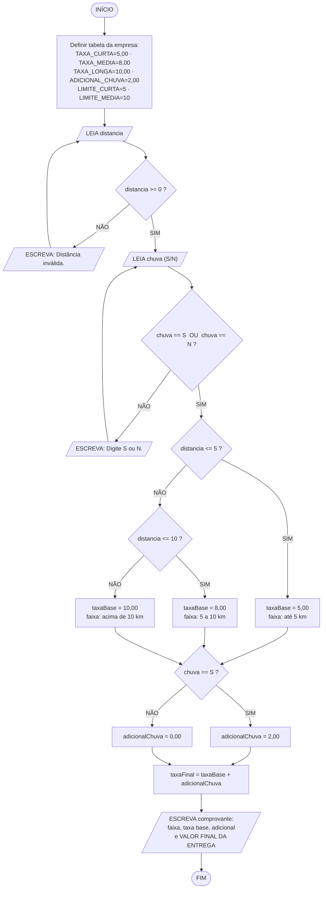

# Sistema de Delivery — Cálculo da Taxa de Entrega
## Algoritmo em linguagem natural, fluxograma e pseudocódigo

---

## Sumário

1. [Especificação](#1-especificação)
2. [Algoritmo em linguagem natural](#2-algoritmo-em-linguagem-natural)
3. [Tabela de decisão](#3-tabela-de-decisão)
4. [Fluxograma](#4-fluxograma)
5. [Convenção de notação do pseudocódigo](#5-convenção-de-notação-do-pseudocódigo)
6. [Pseudocódigo — versão direta](#6-pseudocódigo--versão-direta)
7. [Pseudocódigo — versão modularizada](#7-pseudocódigo--versão-modularizada)
8. [Teste de mesa e exemplo de execução](#8-teste-de-mesa-e-exemplo-de-execução)
9. [Observação sobre as fronteiras das faixas](#9-observação-sobre-as-fronteiras-das-faixas)
10. [Decisões de projeto](#10-decisões-de-projeto)

---


## 1. Especificação


Sistema para uma empresa de delivery que calcula a taxa de entrega a partir da distância até o cliente e da ocorrência de chuva.

| Item | Descrição |
|:-----|:----------|
| **Entrada** | A distância até o cliente em quilômetros (número real) e a informação de estar ou não chovendo (S/N) |
| **Processamento** | Determinar a taxa base pela faixa de distância e, se houver chuva, acrescentar o adicional |
| **Saída** | O detalhamento da cobrança e o **valor final da entrega** |


### 1.1 Regras de negócio


**Regra 1 — Taxa base por faixa de distância** (faixas mutuamente exclusivas):

| Faixa | Condição | Taxa base |
|:------|:---------|----------:|
| Curta | Até 5 km | R$ 5,00 |
| Média | Acima de 5 km até 10 km | R$ 8,00 |
| Longa | Acima de 10 km | R$ 10,00 |

**Regra 2 — Adicional de chuva** (condição independente, aplicada sobre qualquer faixa):

| Condição | Adicional |
|:---------|----------:|
| Está chovendo | + R$ 2,00 |
| Não está chovendo | + R$ 0,00 |

> **Estrutura da regra:** a distância define **uma única** faixa — é um encadeamento de condições exclusivas, onde só uma pode valer. A chuva é uma condição **independente e aditiva**, que se soma ao resultado da faixa qualquer que ela seja. São dois mecanismos lógicos diferentes atuando no mesmo cálculo.


### 1.2 Dicionário de variáveis


| Variável | Tipo | Conteúdo |
|:---------|:-----|:---------|
| `distancia` | real | Distância até o cliente, em quilômetros |
| `chuva` | caractere | `"S"` se está chovendo, `"N"` se não está |
| `taxaBase` | real | Valor definido apenas pela faixa de distância |
| `adicionalChuva` | real | R$ 2,00 se chove, R$ 0,00 se não chove |
| `taxaFinal` | real | `taxaBase + adicionalChuva` — o valor cobrado |
| `faixa` | caractere | Texto descritivo da faixa, para o comprovante |


---

## 2. Algoritmo em linguagem natural


### Fase 1 — Definição dos valores fixos


1. **Iniciar** o processo.
2. **Armazenar** em variáveis fixas os valores da tabela da empresa:
   - `TAXA_CURTA = 5,00` (até 5 km)
   - `TAXA_MEDIA = 8,00` (acima de 5 até 10 km)
   - `TAXA_LONGA = 10,00` (acima de 10 km)
   - `ADICIONAL_CHUVA = 2,00`
   - `LIMITE_CURTA = 5` e `LIMITE_MEDIA = 10` (as fronteiras das faixas)
   > Guardar também os **limites** em variáveis, e não só os preços, permite que uma futura mudança de política — passar a faixa curta para 6 km, por exemplo — seja feita em um único ponto do algoritmo.


### Fase 2 — Entrada dos dados


3. **Solicitar** a distância até o cliente, em quilômetros, e **armazenar** em `distancia`.
4. **Validar** a distância: se for **negativa**, exibir "Distância inválida. Informe um valor maior ou igual a zero." e **voltar ao passo 3**.
5. **Solicitar** se está chovendo, aceitando `S` para sim e `N` para não, e **armazenar** em `chuva`.
6. **Padronizar** a resposta para letra maiúscula, de modo que `s` e `S` sejam equivalentes.
7. **Validar** a resposta: se não for `S` nem `N`, exibir "Resposta inválida. Digite S ou N." e **voltar ao passo 5**.


### Fase 3 — Determinação da taxa base (decisão encadeada)


8. **Verificar a primeira faixa:** a distância é **menor ou igual a 5 km**?
   - **Se sim** → atribuir `taxaBase = TAXA_CURTA` (R$ 5,00) e **seguir para o passo 11**.
   - **Se não** → seguir para o passo 9.

9. **Verificar a segunda faixa:** a distância é **menor ou igual a 10 km**?
   > Neste ponto já se sabe, pelo passo 8, que a distância é **maior que 5 km**. Portanto, esta única comparação já delimita toda a faixa média — não é preciso testar o limite inferior novamente.
   - **Se sim** → atribuir `taxaBase = TAXA_MEDIA` (R$ 8,00) e **seguir para o passo 11**.
   - **Se não** → seguir para o passo 10.

10. **Caso contrário (faixa remanescente):** a distância é necessariamente **maior que 10 km**, pois as faixas inferiores já foram descartadas nos passos 8 e 9. Atribuir `taxaBase = TAXA_LONGA` (R$ 10,00).


### Fase 4 — Aplicação do adicional de chuva (condição independente)


11. **Verificar se está chovendo:** a resposta armazenada em `chuva` é igual a `"S"`?
    - **Se sim** → atribuir `adicionalChuva = ADICIONAL_CHUVA` (R$ 2,00).
    - **Se não** → atribuir `adicionalChuva = 0,00`.
    > Esta decisão **não faz parte** do encadeamento da fase 3. Ela é avaliada sempre, independentemente da faixa que tenha sido escolhida, e por isso vem depois, em bloco separado. Colocá-la dentro do encadeamento obrigaria a repetir o teste de chuva três vezes — uma dentro de cada faixa.


### Fase 5 — Cálculo e saída


12. **Calcular o valor final:** `taxaFinal = taxaBase + adicionalChuva`.
13. **Exibir** o comprovante da entrega, contendo:
    - a distância informada e a faixa em que ela se enquadrou;
    - a condição do tempo (com chuva ou sem chuva);
    - a **taxa base** da faixa;
    - o **adicional de chuva** aplicado;
    - o **VALOR FINAL DA ENTREGA**.
14. **Encerrar** o processo.


---

## 3. Tabela de decisão

As seis situações possíveis — três faixas de distância combinadas com as duas condições de tempo:

| # | Faixa de distância | Chuva | Taxa base | Adicional | **Valor final** |
|:-:|:-------------------|:-----:|----------:|----------:|----------------:|
| 1 | Até 5 km | Não | R$ 5,00 | R$ 0,00 | **R$ 5,00** |
| 2 | Até 5 km | **Sim** | R$ 5,00 | R$ 2,00 | **R$ 7,00** |
| 3 | Acima de 5 até 10 km | Não | R$ 8,00 | R$ 0,00 | **R$ 8,00** |
| 4 | Acima de 5 até 10 km | **Sim** | R$ 8,00 | R$ 2,00 | **R$ 10,00** |
| 5 | Acima de 10 km | Não | R$ 10,00 | R$ 0,00 | **R$ 10,00** |
| 6 | Acima de 10 km | **Sim** | R$ 10,00 | R$ 2,00 | **R$ 12,00** |

> Note que os casos **4 e 5** produzem o mesmo valor final (R$ 10,00) por caminhos completamente diferentes: uma entrega média debaixo de chuva custa o mesmo que uma entrega longa em tempo bom. Coincidência de valores, não de lógica — por isso o comprovante deve discriminar taxa base e adicional, e não apenas o total.

---

## 4. Fluxograma

### 4.1 Simbologia utilizada (ISO 5807 / ANSI)

| Símbolo | Nome | Função no fluxograma |
|:--------|:-----|:---------------------|
| Retângulo arredondado | **Terminal** | Início e fim do processo |
| Paralelogramo | **Entrada / Saída** | `LEIA` do teclado e `ESCREVA` na tela |
| Retângulo | **Processo** | Cálculo ou atribuição |
| Losango | **Decisão** | Teste com duas saídas: SIM e NÃO |
| Seta | **Fluxo** | Sentido do processamento |

### 4.2 Fluxograma completo



> **O ponto de convergência é a chave do diagrama.** Os três blocos de taxa base (`J`, `L`, `M`) apontam para o **mesmo** losango de chuva. Isso mostra graficamente que o teste de chuva é avaliado **uma única vez**, valha qual faixa valer — ele não pertence ao encadeamento das distâncias. Se a chuva fizesse parte do encadeamento, haveria três losangos de chuva em vez de um, e seis blocos de saída em vez de dois.
>
> O diagrama renderiza como fluxograma gráfico no VS Code, GitHub, Notion e em [mermaid.live](https://mermaid.live).

### 4.3 Fluxograma em texto

```
                          ╭────────────────╮
                          │     INÍCIO     │
                          ╰────────┬───────╯
                                   │
              ┌────────────────────▼────────────────────┐
              │  TAXA_CURTA      =  5,00                │
              │  TAXA_MEDIA      =  8,00                │  processo
              │  TAXA_LONGA      = 10,00                │  (tabela da empresa)
              │  ADICIONAL_CHUVA =  2,00                │
              │  LIMITE_CURTA = 5 ; LIMITE_MEDIA = 10   │
              └────────────────────┬────────────────────┘
                                   │
              ┌────────────────────▼────────────────────┐
       ┌─────►│  ESCREVA "Distância até o cliente (km)" /
       │     /   LEIA distancia                         │
       │      └────────────────────┬────────────────────┘
       │                           │
       │                ╱──────────▼──────────╲
       │       NÃO     ╱   distancia >= 0 ?    ╲     SIM
       │  ┌───────────⟨                         ⟩──────────┐
       │  │            ╲                       ╱           │
       │  │             ╲─────────────────────╱            │
       │  ▼                                                │
       │ ┌─────────────────────────────┐                   │
       └─/  ESCREVA "Distância inválida"│                  │
         └─────────────────────────────┘                   │
                                                           │
              ┌────────────────────────────────────────────┘
              │
              ▼
              ┌────────────────────────────────────────┐
       ┌─────►│  ESCREVA "Está chovendo? (S/N)"        /
       │     /   LEIA chuva                            │
       │      │   chuva = MAIUSC(chuva)                │
       │      └────────────────────┬───────────────────┘
       │                           │
       │                ╱──────────▼──────────╲
       │       NÃO     ╱ chuva=="S" OU =="N" ? ╲     SIM
       │  ┌───────────⟨                         ⟩──────────┐
       │  │            ╲                       ╱           │
       │  │             ╲─────────────────────╱            │
       │  ▼                                                │
       │ ┌────────────────────────────┐                    │
       └─/  ESCREVA "Digite S ou N"   │                    │
         └────────────────────────────┘                    │
                                                           │
   ┌═══════════════════════════════════════════════════════┘
   ║   FAIXA DE DISTÂNCIA — encadeamento exclusivo
   ║                       │
   ║            ╱──────────▼──────────╲
   ║           ╱   distancia <= 5 ?    ╲
   ║  ┌───────⟨                         ⟩───────┐
   ║  │ SIM    ╲                       ╱   NÃO  │
   ║  │         ╲─────────────────────╱         │
   ║  ▼                                         ▼
   ║ ┌────────────────────┐          ╱──────────────────╲
   ║ │ taxaBase = 5,00    │         ╱ distancia <= 10 ?  ╲
   ║ └─────────┬──────────┘  ┌─────⟨                      ⟩─────┐
   ║           │         SIM │      ╲                    ╱      │ NÃO
   ║           │             │       ╲──────────────────╱       │
   ║           │             ▼                                  ▼
   ║           │   ┌────────────────────┐          ┌────────────────────┐
   ║           │   │ taxaBase = 8,00    │          │ taxaBase = 10,00   │
   ║           │   └─────────┬──────────┘          └─────────┬──────────┘
   ║           │             │                               │
   ║           └─────────────┴───────────┬───────────────────┘
   ╚═══════════════════════════════════  │  ═══════════════════════════════
                                         │   ◄── os TRÊS caminhos convergem
   ┌═════════════════════════════════════▼═════════════════════════════════
   ║   ADICIONAL DE CHUVA — condição independente, avaliada UMA vez
   ║                ╱────────────────────╲
   ║               ╱    chuva == "S" ?    ╲
   ║      ┌───────⟨                        ⟩───────┐
   ║      │ SIM    ╲                      ╱   NÃO  │
   ║      │         ╲────────────────────╱         │
   ║      ▼                                        ▼
   ║ ┌──────────────────────────┐   ┌──────────────────────────┐
   ║ │ adicionalChuva = 2,00    │   │ adicionalChuva = 0,00    │
   ║ └────────────┬─────────────┘   └────────────┬─────────────┘
   ║              │                              │
   ╚══════════════┴───────────────┬══════════════┘
                                  │
              ┌───────────────────▼───────────────────┐
              │  taxaFinal = taxaBase + adicionalChuva│
              └───────────────────┬───────────────────┘
                                  │
              ┌───────────────────▼───────────────────┐
             /   ESCREVA comprovante: faixa aplicada, │
              │  taxa base, adicional de chuva e      │
             /   VALOR FINAL DA ENTREGA               │
              └───────────────────┬───────────────────┘
                                  │
                          ╭───────▼────────╮
                          │      FIM       │
                          ╰────────────────╯
```

---

## 5. Convenção de notação do pseudocódigo

| Elemento | Símbolo | Exemplo |
|:---------|:--------|:--------|
| Atribuição | **`=`** | `taxaBase = 5,00` |
| Igualdade | **`==`** | `SE (chuva == "S") ENTÃO` |
| Diferença | **`!=`** | `SE (c != "S") E (c != "N") ENTÃO` |
| Demais comparações | `<` `<=` `>` `>=` | `SE (d <= LIMITE_CURTA) ENTÃO` |
| Estrutura condicional | **`SE ... ENTÃO ... SENÃO ... FIMSE`** | — |
| Separador decimal | **`,`** (vírgula) | `TAXA_MEDIA = 8,00` |
| Separador de argumentos em **chamadas** | **`;`** (ponto e vírgula) | `TaxaFinalDe(taxaBase; adicionalChuva)` |
| Separador de parâmetros na **declaração** | **`;`** (ponto e vírgula) | `FUNÇÃO f(a : real ; b : caractere)` |

> **Por que ponto e vírgula nos argumentos:** a vírgula já é o separador decimal. Se também separasse argumentos, `TaxaFinalDe(1,5, 2,0)` ficaria ambíguo — dois argumentos ou quatro? Com `TaxaFinalDe(1,5; 2,0)` a leitura é única, e o mesmo símbolo passa a valer tanto na declaração quanto na chamada.
>
> **Sobre os acentos:** as palavras-chave usam `ENTÃO`, `SENÃO`, `ATÉ`, `INÍCIO`, `FUNÇÃO`. Se o interpretador utilizado recusar caracteres acentuados, basta removê-los (`ENTAO`, `SENAO`, `ATE`) — a lógica não muda.

---

## 6. Pseudocódigo — versão direta

```
ALGORITMO "DELIVERY_TAXA_ENTREGA"

VAR
   // ---------- TABELA DA EMPRESA (constantes de negocio) ----------
   TAXA_CURTA      : real
   TAXA_MEDIA      : real
   TAXA_LONGA      : real
   ADICIONAL_CHUVA : real
   LIMITE_CURTA    : real
   LIMITE_MEDIA    : real

   // ---------- DADOS INFORMADOS ----------
   distancia : real
   chuva     : caractere

   // ---------- VALORES CALCULADOS ----------
   taxaBase       : real
   adicionalChuva : real
   taxaFinal      : real
   faixa          : caractere

INÍCIO
   // ============================================================
   // FASE 1 - CARGA DA TABELA
   // Guardar tambem os LIMITES em variaveis permite mudar a
   // politica de faixas em um unico ponto.
   // ============================================================
   TAXA_CURTA      = 5,00
   TAXA_MEDIA      = 8,00
   TAXA_LONGA      = 10,00
   ADICIONAL_CHUVA = 2,00
   LIMITE_CURTA    = 5
   LIMITE_MEDIA    = 10

   ESCREVAL("========================================")
   ESCREVAL("      CALCULO DA TAXA DE ENTREGA        ")
   ESCREVAL("========================================")

   // ============================================================
   // FASE 2 - ENTRADA DA DISTANCIA (com validacao)
   // Zero e valido: retirada no proprio estabelecimento.
   // ============================================================
   REPITA
      ESCREVA("Distancia ate o cliente (km): ")
      LEIA(distancia)

      SE (distancia < 0) ENTÃO
         ESCREVAL(">> Distancia invalida. Informe zero ou mais.")
      FIMSE
   ATÉ (distancia >= 0)

   // ============================================================
   // FASE 2b - ENTRADA DA CONDICAO DE CHUVA (com validacao)
   // MAIUSC padroniza a resposta: "s" e "S" sao equivalentes.
   // ============================================================
   REPITA
      ESCREVA("Esta chovendo? (S/N): ")
      LEIA(chuva)
      chuva = MAIUSC(chuva)

      SE (chuva != "S") E (chuva != "N") ENTÃO
         ESCREVAL(">> Resposta invalida. Digite S ou N.")
      FIMSE
   ATÉ (chuva == "S") OU (chuva == "N")

   // ============================================================
   // FASE 3 - TAXA BASE (encadeamento exclusivo por faixa)
   // Cada teste verifica apenas o LIMITE SUPERIOR da sua faixa:
   // o limite inferior ja esta garantido pelo teste anterior
   // ter falhado.
   // ============================================================
   SE (distancia <= LIMITE_CURTA) ENTÃO
      taxaBase = TAXA_CURTA
      faixa    = "ate 5 km"
   SENÃO
      SE (distancia <= LIMITE_MEDIA) ENTÃO     // aqui ja se sabe: distancia > 5
         taxaBase = TAXA_MEDIA
         faixa    = "acima de 5 ate 10 km"
      SENÃO                                    // resta apenas distancia > 10
         taxaBase = TAXA_LONGA
         faixa    = "acima de 10 km"
      FIMSE
   FIMSE

   // ============================================================
   // FASE 4 - ADICIONAL DE CHUVA (condicao INDEPENDENTE)
   // Avaliada UMA vez, fora do encadeamento acima, qualquer
   // que tenha sido a faixa escolhida.
   // ============================================================
   SE (chuva == "S") ENTÃO
      adicionalChuva = ADICIONAL_CHUVA
   SENÃO
      adicionalChuva = 0,00
   FIMSE

   // ============================================================
   // FASE 5 - CALCULO E SAIDA
   // ============================================================
   taxaFinal = taxaBase + adicionalChuva

   ESCREVAL("")
   ESCREVAL("========================================")
   ESCREVAL("        COMPROVANTE DE ENTREGA          ")
   ESCREVAL("========================================")
   ESCREVAL("Distancia informada .....: "; distancia:0:1; " km")
   ESCREVAL("Faixa aplicada ..........: "; faixa)

   SE (chuva == "S") ENTÃO
      ESCREVAL("Condicao do tempo .......: COM CHUVA")
   SENÃO
      ESCREVAL("Condicao do tempo .......: SEM CHUVA")
   FIMSE

   ESCREVAL("----------------------------------------")
   ESCREVAL("Taxa base ...............: R$ "; taxaBase:7:2)
   ESCREVAL("Adicional de chuva ......: R$ "; adicionalChuva:7:2)
   ESCREVAL("----------------------------------------")
   ESCREVAL("VALOR FINAL DA ENTREGA ..: R$ "; taxaFinal:7:2)
   ESCREVAL("========================================")

FIMALGORITMO
```

### 6.1 Variante com `SENÃOSE`

Interpretadores que aceitam a cláusula `SENÃOSE` permitem escrever o encadeamento sem aninhamento, deixando as três faixas no mesmo nível visual:

```
   SE (distancia <= LIMITE_CURTA) ENTÃO
      taxaBase = TAXA_CURTA
      faixa    = "ate 5 km"
   SENÃOSE (distancia <= LIMITE_MEDIA) ENTÃO
      taxaBase = TAXA_MEDIA
      faixa    = "acima de 5 ate 10 km"
   SENÃO
      taxaBase = TAXA_LONGA
      faixa    = "acima de 10 km"
   FIMSE
```

Os dois trechos são **logicamente idênticos** — `SENÃOSE` é apenas açúcar sintático para o `SE` aninhado dentro do `SENÃO`.

---

## 7. Pseudocódigo — versão modularizada

```
ALGORITMO "DELIVERY_TAXA_ENTREGA_MODULAR"

// ============================================================
// AREA DE DADOS GLOBAIS
// ============================================================
VAR
   TAXA_CURTA, TAXA_MEDIA, TAXA_LONGA : real
   ADICIONAL_CHUVA                     : real
   LIMITE_CURTA, LIMITE_MEDIA          : real

   distancia      : real
   chuva          : caractere
   taxaBase       : real
   adicionalChuva : real
   taxaFinal      : real


// ============================================================
// MODULO 1 - CARGA DA TABELA DA EMPRESA
// Unico ponto do sistema que conhece valores e limites.
// ============================================================
PROCEDIMENTO DefinirTabela()
INÍCIO
   TAXA_CURTA      = 5,00
   TAXA_MEDIA      = 8,00
   TAXA_LONGA      = 10,00
   ADICIONAL_CHUVA = 2,00
   LIMITE_CURTA    = 5
   LIMITE_MEDIA    = 10
FIMPROCEDIMENTO


// ============================================================
// MODULO 2 - VALIDACAO DA DISTANCIA
// ============================================================
FUNÇÃO DistanciaValida(d : real) : logico
INÍCIO
   RETORNE (d >= 0)
FIMFUNÇÃO


// ============================================================
// MODULO 3 - LEITURA DA DISTANCIA
// ============================================================
FUNÇÃO LerDistancia() : real
VAR
   d : real
INÍCIO
   REPITA
      ESCREVA("Distancia ate o cliente (km): ")
      LEIA(d)

      SE (NÃO DistanciaValida(d)) ENTÃO
         ESCREVAL(">> Distancia invalida. Informe zero ou mais.")
      FIMSE
   ATÉ DistanciaValida(d)

   RETORNE d
FIMFUNÇÃO


// ============================================================
// MODULO 4 - LEITURA DA CONDICAO DE CHUVA
// ============================================================
FUNÇÃO LerChuva() : caractere
VAR
   c : caractere
INÍCIO
   REPITA
      ESCREVA("Esta chovendo? (S/N): ")
      LEIA(c)
      c = MAIUSC(c)

      SE (c != "S") E (c != "N") ENTÃO
         ESCREVAL(">> Resposta invalida. Digite S ou N.")
      FIMSE
   ATÉ (c == "S") OU (c == "N")

   RETORNE c
FIMFUNÇÃO


// ============================================================
// MODULO 5 - REGRA DA FAIXA DE DISTANCIA
// Funcao pura. Retornos antecipados dispensam o SENÃO:
// cada RETORNE encerra a funcao, tornando os testes
// mutuamente exclusivos sem aninhamento.
// ============================================================
FUNÇÃO TaxaBaseDe(d : real) : real
INÍCIO
   SE (d <= LIMITE_CURTA) ENTÃO
      RETORNE TAXA_CURTA
   FIMSE

   SE (d <= LIMITE_MEDIA) ENTÃO             // aqui ja se sabe: d > LIMITE_CURTA
      RETORNE TAXA_MEDIA
   FIMSE

   RETORNE TAXA_LONGA                       // resta apenas d > LIMITE_MEDIA
FIMFUNÇÃO


// ============================================================
// MODULO 6 - NOME DA FAIXA (apresentacao)
// Separado do calculo: mudar o texto do comprovante nao
// toca na regra de negocio.
// ============================================================
FUNÇÃO NomeFaixaDe(d : real) : caractere
INÍCIO
   SE (d <= LIMITE_CURTA) ENTÃO
      RETORNE "ate 5 km"
   FIMSE

   SE (d <= LIMITE_MEDIA) ENTÃO
      RETORNE "acima de 5 ate 10 km"
   FIMSE

   RETORNE "acima de 10 km"
FIMFUNÇÃO


// ============================================================
// MODULO 7 - REGRA DO ADICIONAL DE CHUVA
// Independente da faixa: recebe apenas a condicao do tempo.
// ============================================================
FUNÇÃO AdicionalDe(c : caractere) : real
INÍCIO
   SE (c == "S") ENTÃO
      RETORNE ADICIONAL_CHUVA
   FIMSE

   RETORNE 0,00
FIMFUNÇÃO


// ============================================================
// MODULO 8 - CALCULO DO VALOR FINAL
// ============================================================
FUNÇÃO TaxaFinalDe(base : real ; adicional : real) : real
INÍCIO
   RETORNE (base + adicional)
FIMFUNÇÃO


// ============================================================
// MODULO 9 - EMISSAO DO COMPROVANTE
// ============================================================
PROCEDIMENTO ExibirComprovante(d : real ; c : caractere ;
                               base : real ; adicional : real ; final : real)
INÍCIO
   ESCREVAL("")
   ESCREVAL("========================================")
   ESCREVAL("        COMPROVANTE DE ENTREGA          ")
   ESCREVAL("========================================")
   ESCREVAL("Distancia informada .....: "; d:0:1; " km")
   ESCREVAL("Faixa aplicada ..........: "; NomeFaixaDe(d))

   SE (c == "S") ENTÃO
      ESCREVAL("Condicao do tempo .......: COM CHUVA")
   SENÃO
      ESCREVAL("Condicao do tempo .......: SEM CHUVA")
   FIMSE

   ESCREVAL("----------------------------------------")
   ESCREVAL("Taxa base ...............: R$ "; base:7:2)
   ESCREVAL("Adicional de chuva ......: R$ "; adicional:7:2)
   ESCREVAL("----------------------------------------")
   ESCREVAL("VALOR FINAL DA ENTREGA ..: R$ "; final:7:2)
   ESCREVAL("========================================")
FIMPROCEDIMENTO


// ============================================================
// PROGRAMA PRINCIPAL
// Apenas coordena os modulos - nenhuma regra de negocio aqui.
// ============================================================
INÍCIO
   DefinirTabela()

   ESCREVAL("========================================")
   ESCREVAL("      CALCULO DA TAXA DE ENTREGA        ")
   ESCREVAL("========================================")

   distancia      = LerDistancia()
   chuva          = LerChuva()

   taxaBase       = TaxaBaseDe(distancia)
   adicionalChuva = AdicionalDe(chuva)
   taxaFinal      = TaxaFinalDe(taxaBase; adicionalChuva)

   ExibirComprovante(distancia; chuva; taxaBase; adicionalChuva; taxaFinal)

FIMALGORITMO
```

### 7.1 Catálogo de módulos

| Módulo | Tipo | Parâmetros | Retorno | Responsabilidade |
|:-------|:-----|:-----------|:--------|:-----------------|
| `DefinirTabela` | Procedimento | — | — | Carrega taxas, adicional e limites |
| `DistanciaValida` | Função | `d: real` | `logico` | Aceita distâncias de zero em diante |
| `LerDistancia` | Função | — | `real` | Lê insistindo até obter valor válido |
| `LerChuva` | Função | — | `caractere` | Lê e padroniza a resposta S/N |
| `TaxaBaseDe` | Função | `d: real` | `real` | **Regra da faixa** — encadeamento exclusivo |
| `NomeFaixaDe` | Função | `d: real` | `caractere` | Texto da faixa para o comprovante |
| `AdicionalDe` | Função | `c: caractere` | `real` | **Regra do adicional** — condição independente |
| `TaxaFinalDe` | Função | `base`, `adicional` | `real` | Soma dos dois componentes |
| `ExibirComprovante` | Procedimento | `d`, `c`, `base`, `adicional`, `final` | — | Monta o comprovante completo |

### 7.2 Hierarquia de chamadas

```
PROGRAMA PRINCIPAL
│
├── DefinirTabela()
│
├── LerDistancia()
│   └── DistanciaValida(d)
│
├── LerChuva()
│
├── TaxaBaseDe(distancia)          ◄── regra 1: faixa de distância
│
├── AdicionalDe(chuva)             ◄── regra 2: adicional de chuva
│
├── TaxaFinalDe(taxaBase; adicionalChuva)
│
└── ExibirComprovante(...)
    └── NomeFaixaDe(d)
```

> As duas regras de negócio ficam em **funções irmãs e independentes** — `TaxaBaseDe` recebe só a distância, `AdicionalDe` recebe só a condição do tempo. Nenhuma conhece a outra. É a tradução, em código, do que o fluxograma mostra com as três setas convergindo num único losango de chuva.

### 7.3 Comparação das versões

| Critério | Direta | Modular |
|:---------|:-------|:--------|
| Linhas aproximadas | ~110 | ~190 |
| Regras de negócio isoláveis para teste | não | **sim** (`TaxaBaseDe`, `AdicionalDe`) |
| Mudar o texto do comprovante afeta a regra | sim | **não** (`NomeFaixaDe` é separada) |
| Trocar entrada de teclado por arquivo | reescrever o miolo | trocar `LerDistancia` e `LerChuva` |
| Incluir uma 4ª faixa exige mexer em | 1 lugar | 2 lugares (`TaxaBaseDe` + `NomeFaixaDe`) |
| Legibilidade do fluxo principal | média (tudo em sequência) | **alta** (7 chamadas) |

**Recomendação:** a **versão direta** é suficiente para a entrega e mais fácil de acompanhar linha a linha. A **versão modular** é a que se defende melhor tecnicamente, porque separa as duas regras de negócio em funções puras — que podem ser testadas isoladamente contra a tabela de decisão, sem executar o programa inteiro.

---

## 8. Teste de mesa e exemplo de execução

### 8.1 Teste de mesa

| # | `distancia` | `chuva` | `<= 5?` | `<= 10?` | `taxaBase` | `adicionalChuva` | **`taxaFinal`** |
|:-:|------------:|:-------:|:-------:|:--------:|-----------:|-----------------:|----------------:|
| 1 | 3,0 km | N | **V** | — | 5,00 | 0,00 | **R$ 5,00** |
| 2 | 3,0 km | S | **V** | — | 5,00 | 2,00 | **R$ 7,00** |
| 3 | **5,0 km** | N | **V** | — | 5,00 | 0,00 | **R$ 5,00** |
| 4 | **5,1 km** | N | F | **V** | 8,00 | 0,00 | **R$ 8,00** |
| 5 | 7,5 km | S | F | **V** | 8,00 | 2,00 | **R$ 10,00** |
| 6 | **10,0 km** | N | F | **V** | 8,00 | 0,00 | **R$ 8,00** |
| 7 | **10,1 km** | N | F | F | 10,00 | 0,00 | **R$ 10,00** |
| 8 | 25,0 km | S | F | F | 10,00 | 2,00 | **R$ 12,00** |
| 9 | 0,0 km | N | **V** | — | 5,00 | 0,00 | **R$ 5,00** |
| 10 | −2,0 km | — | *rejeitado por `DistanciaValida`* | — | — | — | Distância inválida (relê) |

As seis combinações da tabela de decisão (3 faixas × 2 condições de tempo) estão cobertas pelos casos 1 a 8. As linhas **3, 4, 6 e 7** exercitam as fronteiras exatas das faixas.

### 8.2 Saída do caso 5

**Entrada:** distância 7,5 km, está chovendo.

```
========================================
        COMPROVANTE DE ENTREGA
========================================
Distancia informada .....: 7,5 km
Faixa aplicada ..........: acima de 5 ate 10 km
Condicao do tempo .......: COM CHUVA
----------------------------------------
Taxa base ...............: R$    8,00
Adicional de chuva ......: R$    2,00
----------------------------------------
VALOR FINAL DA ENTREGA ..: R$   10,00
========================================
```

---

## 9. Observação sobre as fronteiras das faixas

O enunciado define as faixas como "**até 5 km**", "**entre 5 e 10 km**" e "**acima de 10 km**". Lida ao pé da letra, essa redação é ambígua em dois pontos:

| Distância | Ambiguidade | Leitura adotada |
|:----------|:------------|:----------------|
| Exatamente **5,0 km** | Cabe em "até 5" **e** em "entre 5 e 10" | Pertence à faixa curta — **R$ 5,00** |
| Exatamente **10,0 km** | "Entre 5 e 10" inclui o 10? "Acima de 10" o exclui | Pertence à faixa média — **R$ 8,00** |

O algoritmo resolve ambos os casos adotando a leitura comercialmente correta — a que favorece o cliente e é coerente com o texto:

- **"até 5 km"** é inclusivo → o teste é `distancia <= 5`;
- **"acima de 10 km"** é estritamente maior → 10,0 km ainda paga a taxa média, e apenas a partir de 10,01 km entra a faixa longa.

Com isso, as três faixas ficam **contíguas e sem sobreposição**, cobrindo toda a reta dos números reais não negativos:

```
    0 ────────────── 5 ────────────── 10 ──────────────► ∞
    │◄─── R$ 5,00 ───►│◄─── R$ 8,00 ───►│◄─ R$ 10,00 ─────►
        (dist <= 5)     (5 < dist <= 10)   (dist > 10)
```

---

## 10. Decisões de projeto

- **Duas lógicas distintas no mesmo algoritmo.** A distância é resolvida por **encadeamento exclusivo** (`SE` / `SENÃO` / `SENÃO`) — só uma faixa pode valer. A chuva é uma **condição independente aditiva**, avaliada em bloco separado. Confundir as duas é o erro mais comum neste tipo de exercício: quem coloca o teste de chuva dentro do encadeamento acaba escrevendo seis ramos em vez de três mais um.

- **Cada faixa testa apenas o limite superior.** O segundo teste é `distancia <= 10`, e não `distancia > 5 E distancia <= 10`. A condição `distancia > 5` já está garantida pelo fato de o primeiro teste ter falhado. Repeti-la seria redundante e criaria dois pontos a manter caso o limite de 5 km mudasse.

- **A última faixa não tem teste.** O `SENÃO` final captura tudo o que sobrou, tornando o algoritmo **exaustivo por construção**: nenhuma distância válida pode escapar sem receber taxa.

- **Adicional em variável, não somado direto.** Guardar `adicionalChuva` — mesmo quando vale zero — permite que o comprovante mostre a linha "Adicional de chuva: R$ 0,00" e que o cliente entenda a composição do preço. Somar R$ 2,00 diretamente ao total esconderia essa informação.

- **Limites e valores em variáveis nomeadas.** `TAXA_MEDIA` e `LIMITE_CURTA` deixam explícito o que cada número significa. Escrever `8,00` e `5` soltos no meio da lógica funciona, mas obriga quem for manter o sistema a deduzir o significado de cada literal.

- **Distância é número real, não inteiro.** Entregas de 7,5 km ou 2,3 km são a norma, não a exceção. Declarar `distancia` como inteiro truncaria 5,9 km para 5 km e cobraria a faixa errada.

- **Zero é distância válida.** Retirada no próprio estabelecimento tem distância 0 e paga a faixa curta. Por isso a validação testa `distancia >= 0`, e não `distancia > 0`.

- **`=` e `==` fazem coisas opostas.** `taxaBase = TAXA_CURTA` **grava** um valor; `chuva == "S"` **pergunta** se são iguais. Trocar um pelo outro é o erro mais comum nessa notação: escrever `SE (chuva = "S") ENTÃO` significaria atribuir `"S"` a `chuva` dentro do teste — o resultado seria sempre verdadeiro e a condição perderia a função.
