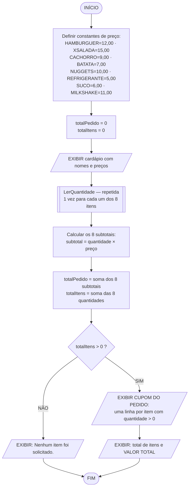
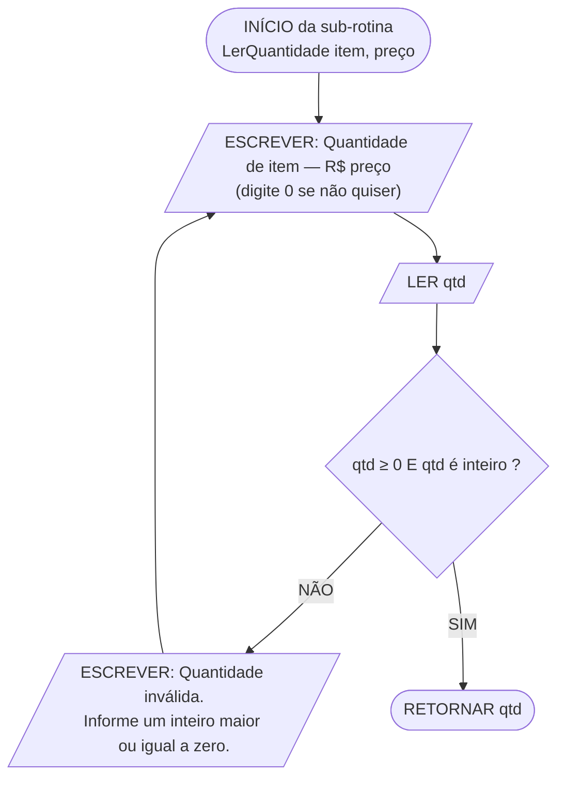

# Aplicativo de Lanchonete — Cálculo do Valor Total do Pedido
## Algoritmo em linguagem natural, fluxograma e pseudocódigo

---

## Sumário

1. [Especificação](#1-especificação)
2. [Algoritmo em linguagem natural](#2-algoritmo-em-linguagem-natural)
3. [Fluxograma](#3-fluxograma)
4. [Pseudocódigo — versão direta](#4-pseudocódigo--versão-direta)
5. [Pseudocódigo — versão modularizada](#5-pseudocódigo--versão-modularizada)
6. [Pseudocódigo — versão com vetores](#6-pseudocódigo--versão-com-vetores)
7. [Teste de mesa e exemplo de execução](#7-teste-de-mesa-e-exemplo-de-execução)
8. [Comparação das versões](#8-comparação-das-versões)
9. [Decisões de projeto](#9-decisões-de-projeto)

---

## 1. Especificação

Funcionalidade para um aplicativo de lanchonete que calcula o valor total de um pedido com base na quantidade de itens solicitados.

| Item | Descrição |
|:-----|:----------|
| **Entrada** | A quantidade solicitada de cada item do cardápio (números inteiros, zero ou mais) |
| **Processamento** | Multiplicar cada quantidade pelo preço unitário correspondente e somar os subtotais |
| **Saída** | Cupom com o subtotal de cada item pedido, a quantidade total de itens e o **valor total do pedido** |

### 1.1 Cardápio (itens originais + itens criados)

| Cód. | Item | Categoria | Preço unitário | Origem |
|:----:|:-----|:----------|---------------:|:-------|
| 1 | Hambúrguer | Lanches | R$ 12,00 | *enunciado* |
| 2 | X-Salada | Lanches | R$ 15,00 | **criado** |
| 3 | Cachorro-quente | Lanches | R$ 9,00 | **criado** |
| 4 | Batata frita | Acompanhamentos | R$ 7,00 | *enunciado* |
| 5 | Porção de nuggets | Acompanhamentos | R$ 10,00 | **criado** |
| 6 | Refrigerante | Bebidas | R$ 5,00 | *enunciado* |
| 7 | Suco natural | Bebidas | R$ 6,00 | **criado** |
| 8 | Milk-shake | Bebidas | R$ 11,00 | **criado** |

### 1.2 Dicionário de variáveis

**Constantes de preço** — valores fixos, definidos pela lanchonete, nunca alterados durante a execução:

| Variável | Tipo | Valor |
|:---------|:-----|------:|
| `PRECO_HAMBURGUER` | real | 12,00 |
| `PRECO_XSALADA` | real | 15,00 |
| `PRECO_CACHORRO` | real | 9,00 |
| `PRECO_BATATA` | real | 7,00 |
| `PRECO_NUGGETS` | real | 10,00 |
| `PRECO_REFRIGERANTE` | real | 5,00 |
| `PRECO_SUCO` | real | 6,00 |
| `PRECO_MILKSHAKE` | real | 11,00 |

**Variáveis de quantidade** — preenchidas pelo cliente:

| Variável | Tipo | Conteúdo |
|:---------|:-----|:---------|
| `qtdHamburguer`, `qtdXsalada`, `qtdCachorro` | inteiro | Unidades de cada lanche |
| `qtdBatata`, `qtdNuggets` | inteiro | Unidades de cada acompanhamento |
| `qtdRefrigerante`, `qtdSuco`, `qtdMilkshake` | inteiro | Unidades de cada bebida |

**Variáveis calculadas:**

| Variável | Tipo | Conteúdo |
|:---------|:-----|:---------|
| `subHamburguer` … `subMilkshake` | real | `quantidade × preço unitário` de cada item |
| `totalItens` | inteiro | Soma de todas as quantidades |
| `totalPedido` | real | Soma de todos os subtotais |

---

## 2. Algoritmo em linguagem natural

### Fase 1 — Definição dos preços (carga das constantes)

1. **Iniciar** o processo.
2. **Armazenar** em variáveis fixas o preço unitário de cada item do cardápio: hambúrguer 12,00; X-salada 15,00; cachorro-quente 9,00; batata frita 7,00; nuggets 10,00; refrigerante 5,00; suco natural 6,00; milk-shake 11,00.
   > Os preços ficam em variáveis próprias, e não escritos direto na conta. Se a lanchonete reajustar a tabela, altera-se **um** ponto do algoritmo, e não todas as multiplicações.
3. **Zerar** as variáveis `totalPedido` e `totalItens`, que serão usadas como acumuladores.

### Fase 2 — Exibição do cardápio

4. **Exibir** na tela o cardápio completo, com o nome e o preço unitário de cada um dos oito itens, para que o cliente saiba o que pode pedir e quanto custa.

### Fase 3 — Leitura das quantidades

5. Para **cada um dos oito itens do cardápio**, repetir o seguinte procedimento:
   1. **Solicitar** a quantidade desejada daquele item, deixando claro que zero é uma resposta válida (significa "não quero este item").
   2. **Ler e armazenar** o valor na variável de quantidade correspondente.
   3. **Validar**: se a quantidade for **negativa** ou **não for um número inteiro**, exibir "Quantidade inválida. Informe um número inteiro maior ou igual a zero." e **voltar ao passo 5.1** para reler aquele mesmo item.
   4. **Senão**, prosseguir para o próximo item.

### Fase 4 — Cálculo

6. **Calcular o subtotal de cada item**, multiplicando a quantidade informada pelo preço unitário correspondente:
   - `subHamburguer = qtdHamburguer × PRECO_HAMBURGUER`
   - `subXsalada = qtdXsalada × PRECO_XSALADA`
   - `subCachorro = qtdCachorro × PRECO_CACHORRO`
   - `subBatata = qtdBatata × PRECO_BATATA`
   - `subNuggets = qtdNuggets × PRECO_NUGGETS`
   - `subRefrigerante = qtdRefrigerante × PRECO_REFRIGERANTE`
   - `subSuco = qtdSuco × PRECO_SUCO`
   - `subMilkshake = qtdMilkshake × PRECO_MILKSHAKE`
   > Itens não pedidos têm quantidade zero, logo subtotal zero — eles participam da soma sem alterar o resultado. Não é preciso testar antes se o item foi ou não pedido.
7. **Calcular o valor total do pedido**, somando os oito subtotais em `totalPedido`.
8. **Calcular a quantidade total de itens**, somando as oito quantidades em `totalItens`.

### Fase 5 — Emissão do cupom

9. **Exibir** o título **CUPOM DO PEDIDO**.
10. Para cada item, **exibir uma linha somente se a quantidade for maior que zero**, contendo: nome do item, quantidade, preço unitário e subtotal.
    > Aqui o teste `quantidade > 0` é necessário — não para o cálculo, mas para a **legibilidade** do cupom. Nenhum cliente quer ver oito linhas zeradas.
11. **Verificar se houve pedido:** se `totalItens` for igual a zero, exibir "Nenhum item foi solicitado." e seguir para o passo 13.
12. **Exibir a linha de totais:** a quantidade total de itens e o **VALOR TOTAL** do pedido.
13. **Encerrar** o processo.

---

## 3. Fluxograma

### 3.1 Simbologia utilizada (ISO 5807 / ANSI)

| Símbolo | Nome | Função no fluxograma |
|:--------|:-----|:---------------------|
| Retângulo arredondado | **Terminal** | Início e fim do processo |
| Paralelogramo | **Entrada / Saída** | `LER` do teclado e `EXIBIR` na tela |
| Retângulo | **Processo** | Cálculo ou atribuição |
| Retângulo com barras laterais | **Sub-rotina** | Chamada de módulo definido à parte |
| Losango | **Decisão** | Teste com duas saídas: SIM e NÃO |
| Seta | **Fluxo** | Sentido do processamento |

### 3.2 Fluxograma principal



### 3.3 Sub-fluxograma `LerQuantidade` (executado 1 vez por item)



> Os dois blocos acima renderizam como fluxogramas gráficos no VS Code, GitHub, Notion e em [mermaid.live](https://mermaid.live).

### 3.4 Fluxograma em texto (versão expandida com 3 itens)

Para caber na página, o diagrama abaixo mostra o padrão com apenas os três itens do enunciado. Os outros cinco seguem exatamente a mesma estrutura, encaixados na mesma sequência:

```
                  ╭──────────────────╮
                  │      INÍCIO      │
                  ╰────────┬─────────╯
                           │
        ┌──────────────────▼──────────────────┐
        │  PRECO_HAMBURGUER    = 12,00        │
        │  PRECO_BATATA        =  7,00        │   processo
        │  PRECO_REFRIGERANTE  =  5,00        │   (carga das constantes)
        │  ... demais preços ...              │
        └──────────────────┬──────────────────┘
                           │
        ┌──────────────────▼──────────────────┐
        │  totalPedido = 0                    │
        │  totalItens  = 0                    │
        └──────────────────┬──────────────────┘
                           │
        ┌──────────────────▼──────────────────┐
       /   EXIBIR cardápio (nomes e preços)   │
        └──────────────────┬──────────────────┘
                           │
   ┌───────────────────────▼─────────────────────┐
   │  ┌────────────────────────────────────────┐ │
   │ /   LER qtdHamburguer                     │ │◄──┐
   │  └────────────────────┬───────────────────┘ │   │
   │             ╱─────────▼─────────╲           │   │ NÃO
   │            ╱  qtdHamburguer ≥ 0  ╲──────────┼───┘
   │           ⟨    e é inteiro ?      ⟩         │
   │            ╲───────────────────╱            │
   │                      │ SIM                  │
   │  ┌───────────────────▼────────────────────┐ │
   │ /   LER qtdBatata      (mesma validação)  │ │
   │  └───────────────────┬────────────────────┘ │
   │  ┌───────────────────▼────────────────────┐ │
   │ /   LER qtdRefrigerante (mesma validação) │ │
   │  └───────────────────┬────────────────────┘ │
   │            ... demais 5 itens ...           │
   └───────────────────────┬─────────────────────┘
                           │
        ┌──────────────────▼──────────────────────────────┐
        │ subHamburguer   = qtdHamburguer   × 12,00       │
        │ subBatata       = qtdBatata       ×  7,00       │
        │ subRefrigerante = qtdRefrigerante ×  5,00       │
        │ ... demais subtotais ...                        │
        └──────────────────┬──────────────────────────────┘
                           │
        ┌──────────────────▼──────────────────┐
        │  totalPedido = soma dos subtotais   │
        │  totalItens  = soma das quantidades │
        └──────────────────┬──────────────────┘
                           │
                 ╱─────────▼─────────╲
                ╱   totalItens > 0 ?  ╲
      ┌────────⟨                       ⟩────────┐
      │  NÃO    ╲                     ╱   SIM   │
      │          ╲───────────────────╱          │
      ▼                                         ▼
┌──────────────────────┐        ┌────────────────────────────────┐
│ EXIBIR               /       /   EXIBIR CUPOM DO PEDIDO        │
│ "Nenhum item         │        │   (1 linha por item com qtd>0) │
/  foi solicitado."    │        └───────────────┬────────────────┘
└──────────┬───────────┘                        │
           │                    ┌───────────────▼────────────────┐
           │                   /   EXIBIR totalItens e           │
           │                    │   VALOR TOTAL do pedido        │
           │                    └───────────────┬────────────────┘
           │                                    │
           └─────────────────┬──────────────────┘
                             │
                    ╭────────▼─────────╮
                    │       FIM        │
                    ╰──────────────────╯
```

---

## 4. Pseudocódigo — versão direta

### Convenção de notação adotada

| Elemento | Símbolo | Exemplo |
|:---------|:--------|:--------|
| Atribuição | **`=`** | `taxaBase = 5,00` |
| Igualdade | **`==`** | `SE (resposta == "S") ENTÃO` |
| Diferença | **`!=`** | `SE (resposta != "S") ENTÃO` |
| Demais comparações | `<` `<=` `>` `>=` | `SE (media < 5) ENTÃO` |
| Estrutura condicional | **`SE ... ENTÃO ... SENÃO ... FIMSE`** | palavras-chave em maiúsculas |
| Separador decimal | **`,`** (vírgula) | `PRECO = 12,00` |
| Separador de argumentos na chamada | **`;`** (ponto e vírgula) | `Subtotal(qtd; preco)` |
| Separador de parâmetros na declaração | **`;`** (ponto e vírgula) | `FUNÇÃO f(a : real ; b : caractere)` |

> **`=` e `==` fazem coisas opostas.** `taxaBase = 5,00` **grava** um valor; `resposta == "S"` **pergunta** se são iguais. Escrever `SE (resposta = "S") ENTÃO` significaria atribuir dentro do teste — a condição perderia a função.
>
> **Por que ponto e vírgula nos argumentos:** a vírgula já é o separador decimal. Se também separasse argumentos, `f(1,5, 2,0)` ficaria ambíguo — dois argumentos ou quatro? Com `f(1,5; 2,0)` a leitura é única.
>
> **Sobre os acentos:** as palavras-chave usam `ENTÃO`, `SENÃO`, `ATÉ`, `INÍCIO`, `FUNÇÃO`, `FAÇA`. Se o interpretador utilizado recusar caracteres acentuados, basta removê-los (`ENTAO`, `SENAO`, `ATE`, `INICIO`, `FUNCAO`, `FACA`) — a lógica não muda.


Atende literalmente ao enunciado: cada preço, cada quantidade e cada subtotal em sua própria variável nomeada.

```
ALGORITMO "LANCHONETE_CALCULO_PEDIDO"

VAR
   // ---------- PRECOS UNITARIOS (constantes de negocio) ----------
   PRECO_HAMBURGUER   : real
   PRECO_XSALADA      : real
   PRECO_CACHORRO     : real
   PRECO_BATATA       : real
   PRECO_NUGGETS      : real
   PRECO_REFRIGERANTE : real
   PRECO_SUCO         : real
   PRECO_MILKSHAKE    : real

   // ---------- QUANTIDADES INFORMADAS PELO CLIENTE ----------
   qtdHamburguer   : inteiro
   qtdXsalada      : inteiro
   qtdCachorro     : inteiro
   qtdBatata       : inteiro
   qtdNuggets      : inteiro
   qtdRefrigerante : inteiro
   qtdSuco         : inteiro
   qtdMilkshake    : inteiro

   // ---------- SUBTOTAIS ----------
   subHamburguer   : real
   subXsalada      : real
   subCachorro     : real
   subBatata       : real
   subNuggets      : real
   subRefrigerante : real
   subSuco         : real
   subMilkshake    : real

   // ---------- ACUMULADORES ----------
   totalPedido : real
   totalItens  : inteiro

INÍCIO
   // ============================================================
   // FASE 1 - CARGA DOS PRECOS
   // Alterar um preco aqui reajusta todo o sistema.
   // ============================================================
   PRECO_HAMBURGUER   = 12,00
   PRECO_XSALADA      = 15,00
   PRECO_CACHORRO     =  9,00
   PRECO_BATATA       =  7,00
   PRECO_NUGGETS      = 10,00
   PRECO_REFRIGERANTE =  5,00
   PRECO_SUCO         =  6,00
   PRECO_MILKSHAKE    = 11,00

   totalPedido = 0
   totalItens  = 0

   // ============================================================
   // FASE 2 - EXIBICAO DO CARDAPIO
   // ============================================================
   ESCREVAL("========================================")
   ESCREVAL("            CARDAPIO                    ")
   ESCREVAL("========================================")
   ESCREVAL("LANCHES")
   ESCREVAL("  Hamburguer .............. R$ "; PRECO_HAMBURGUER:0:2)
   ESCREVAL("  X-Salada ................ R$ "; PRECO_XSALADA:0:2)
   ESCREVAL("  Cachorro-quente ......... R$ "; PRECO_CACHORRO:0:2)
   ESCREVAL("ACOMPANHAMENTOS")
   ESCREVAL("  Batata frita ............ R$ "; PRECO_BATATA:0:2)
   ESCREVAL("  Porcao de nuggets ....... R$ "; PRECO_NUGGETS:0:2)
   ESCREVAL("BEBIDAS")
   ESCREVAL("  Refrigerante ............ R$ "; PRECO_REFRIGERANTE:0:2)
   ESCREVAL("  Suco natural ............ R$ "; PRECO_SUCO:0:2)
   ESCREVAL("  Milk-shake .............. R$ "; PRECO_MILKSHAKE:0:2)
   ESCREVAL("========================================")
   ESCREVAL("Informe a quantidade de cada item (0 = nao quero).")
   ESCREVAL("")

   // ============================================================
   // FASE 3 - LEITURA DAS QUANTIDADES (com validacao por item)
   // Zero e resposta valida: por isso o teste e qtd < 0.
   // ============================================================
   REPITA
      ESCREVA("Hamburguer      (R$ "; PRECO_HAMBURGUER:0:2; ") - qtd: ")
      LEIA(qtdHamburguer)
      SE (qtdHamburguer < 0) ENTÃO
         ESCREVAL(">> Quantidade invalida. Informe zero ou mais.")
      FIMSE
   ATÉ (qtdHamburguer >= 0)

   REPITA
      ESCREVA("X-Salada        (R$ "; PRECO_XSALADA:0:2; ") - qtd: ")
      LEIA(qtdXsalada)
      SE (qtdXsalada < 0) ENTÃO
         ESCREVAL(">> Quantidade invalida. Informe zero ou mais.")
      FIMSE
   ATÉ (qtdXsalada >= 0)

   REPITA
      ESCREVA("Cachorro-quente (R$ "; PRECO_CACHORRO:0:2; ") - qtd: ")
      LEIA(qtdCachorro)
      SE (qtdCachorro < 0) ENTÃO
         ESCREVAL(">> Quantidade invalida. Informe zero ou mais.")
      FIMSE
   ATÉ (qtdCachorro >= 0)

   REPITA
      ESCREVA("Batata frita    (R$ "; PRECO_BATATA:0:2; ") - qtd: ")
      LEIA(qtdBatata)
      SE (qtdBatata < 0) ENTÃO
         ESCREVAL(">> Quantidade invalida. Informe zero ou mais.")
      FIMSE
   ATÉ (qtdBatata >= 0)

   REPITA
      ESCREVA("Nuggets         (R$ "; PRECO_NUGGETS:0:2; ") - qtd: ")
      LEIA(qtdNuggets)
      SE (qtdNuggets < 0) ENTÃO
         ESCREVAL(">> Quantidade invalida. Informe zero ou mais.")
      FIMSE
   ATÉ (qtdNuggets >= 0)

   REPITA
      ESCREVA("Refrigerante    (R$ "; PRECO_REFRIGERANTE:0:2; ") - qtd: ")
      LEIA(qtdRefrigerante)
      SE (qtdRefrigerante < 0) ENTÃO
         ESCREVAL(">> Quantidade invalida. Informe zero ou mais.")
      FIMSE
   ATÉ (qtdRefrigerante >= 0)

   REPITA
      ESCREVA("Suco natural    (R$ "; PRECO_SUCO:0:2; ") - qtd: ")
      LEIA(qtdSuco)
      SE (qtdSuco < 0) ENTÃO
         ESCREVAL(">> Quantidade invalida. Informe zero ou mais.")
      FIMSE
   ATÉ (qtdSuco >= 0)

   REPITA
      ESCREVA("Milk-shake      (R$ "; PRECO_MILKSHAKE:0:2; ") - qtd: ")
      LEIA(qtdMilkshake)
      SE (qtdMilkshake < 0) ENTÃO
         ESCREVAL(">> Quantidade invalida. Informe zero ou mais.")
      FIMSE
   ATÉ (qtdMilkshake >= 0)

   // ============================================================
   // FASE 4 - CALCULO DOS SUBTOTAIS E DOS TOTAIS
   // Itens nao pedidos tem qtd 0 e subtotal 0: entram na soma
   // sem alterar o resultado, dispensando testes condicionais.
   // ============================================================
   subHamburguer   = qtdHamburguer   * PRECO_HAMBURGUER
   subXsalada      = qtdXsalada      * PRECO_XSALADA
   subCachorro     = qtdCachorro     * PRECO_CACHORRO
   subBatata       = qtdBatata       * PRECO_BATATA
   subNuggets      = qtdNuggets      * PRECO_NUGGETS
   subRefrigerante = qtdRefrigerante * PRECO_REFRIGERANTE
   subSuco         = qtdSuco         * PRECO_SUCO
   subMilkshake    = qtdMilkshake    * PRECO_MILKSHAKE

   totalPedido = subHamburguer + subXsalada + subCachorro +
                  subBatata + subNuggets +
                  subRefrigerante + subSuco + subMilkshake

   totalItens  = qtdHamburguer + qtdXsalada + qtdCachorro +
                  qtdBatata + qtdNuggets +
                  qtdRefrigerante + qtdSuco + qtdMilkshake

   // ============================================================
   // FASE 5 - EMISSAO DO CUPOM
   // Aqui o teste qtd > 0 e de APRESENTACAO, nao de calculo:
   // evita imprimir linhas zeradas.
   // ============================================================
   ESCREVAL("")
   ESCREVAL("========================================")
   ESCREVAL("            CUPOM DO PEDIDO             ")
   ESCREVAL("========================================")

   SE (totalItens == 0) ENTÃO
      ESCREVAL("Nenhum item foi solicitado.")
   SENÃO
      ESCREVAL("ITEM              QTD    UNIT  SUBTOTAL")
      ESCREVAL("----------------------------------------")

      SE (qtdHamburguer > 0) ENTÃO
         ESCREVAL("Hamburguer":16; qtdHamburguer:6;
                  PRECO_HAMBURGUER:8:2; subHamburguer:10:2)
      FIMSE
      SE (qtdXsalada > 0) ENTÃO
         ESCREVAL("X-Salada":16; qtdXsalada:6;
                  PRECO_XSALADA:8:2; subXsalada:10:2)
      FIMSE
      SE (qtdCachorro > 0) ENTÃO
         ESCREVAL("Cachorro-quente":16; qtdCachorro:6;
                  PRECO_CACHORRO:8:2; subCachorro:10:2)
      FIMSE
      SE (qtdBatata > 0) ENTÃO
         ESCREVAL("Batata frita":16; qtdBatata:6;
                  PRECO_BATATA:8:2; subBatata:10:2)
      FIMSE
      SE (qtdNuggets > 0) ENTÃO
         ESCREVAL("Nuggets":16; qtdNuggets:6;
                  PRECO_NUGGETS:8:2; subNuggets:10:2)
      FIMSE
      SE (qtdRefrigerante > 0) ENTÃO
         ESCREVAL("Refrigerante":16; qtdRefrigerante:6;
                  PRECO_REFRIGERANTE:8:2; subRefrigerante:10:2)
      FIMSE
      SE (qtdSuco > 0) ENTÃO
         ESCREVAL("Suco natural":16; qtdSuco:6;
                  PRECO_SUCO:8:2; subSuco:10:2)
      FIMSE
      SE (qtdMilkshake > 0) ENTÃO
         ESCREVAL("Milk-shake":16; qtdMilkshake:6;
                  PRECO_MILKSHAKE:8:2; subMilkshake:10:2)
      FIMSE

      ESCREVAL("----------------------------------------")
      ESCREVAL("TOTAL DE ITENS ..................: "; totalItens)
      ESCREVAL("VALOR TOTAL .....................: R$ "; totalPedido:0:2)
   FIMSE

   ESCREVAL("========================================")

FIMALGORITMO
```

> **Nota sobre a validação:** o enunciado pede quantidades inteiras. Como as variáveis `qtd*` são declaradas do tipo `inteiro`, o próprio interpretador recusa entradas fracionárias — por isso o `REPITA` só precisa testar o sinal (`qtd >= 0`). Em linguagens de tipagem fraca, seria necessário verificar a integralidade explicitamente.

---

## 5. Pseudocódigo — versão modularizada

Os oito blocos `REPITA` idênticos da versão anterior são o sintoma clássico de código que pede modularização. Aqui eles viram **uma** sub-rotina chamada oito vezes.

```
ALGORITMO "LANCHONETE_CALCULO_PEDIDO_MODULAR"

// ============================================================
// AREA DE DADOS GLOBAIS
// ============================================================
VAR
   // precos unitarios
   PRECO_HAMBURGUER, PRECO_XSALADA, PRECO_CACHORRO       : real
   PRECO_BATATA, PRECO_NUGGETS                            : real
   PRECO_REFRIGERANTE, PRECO_SUCO, PRECO_MILKSHAKE        : real

   // quantidades informadas
   qtdHamburguer, qtdXsalada, qtdCachorro                 : inteiro
   qtdBatata, qtdNuggets                                  : inteiro
   qtdRefrigerante, qtdSuco, qtdMilkshake                 : inteiro

   // acumuladores
   totalPedido : real
   totalItens  : inteiro


// ============================================================
// MODULO 1 - CARGA DOS PRECOS
// Unico ponto do sistema que conhece a tabela de precos.
// ============================================================
PROCEDIMENTO DefinirPrecos()
INÍCIO
   PRECO_HAMBURGUER   = 12,00
   PRECO_XSALADA      = 15,00
   PRECO_CACHORRO     =  9,00
   PRECO_BATATA       =  7,00
   PRECO_NUGGETS      = 10,00
   PRECO_REFRIGERANTE =  5,00
   PRECO_SUCO         =  6,00
   PRECO_MILKSHAKE    = 11,00
FIMPROCEDIMENTO


// ============================================================
// MODULO 2 - LINHA DO CARDAPIO
// ============================================================
PROCEDIMENTO LinhaCardapio(nome : caractere ; preco : real)
INÍCIO
   ESCREVAL("  "; nome:22; " R$ "; preco:6:2)
FIMPROCEDIMENTO


// ============================================================
// MODULO 3 - EXIBICAO DO CARDAPIO
// ============================================================
PROCEDIMENTO ExibirCardapio()
INÍCIO
   ESCREVAL("========================================")
   ESCREVAL("               CARDAPIO                 ")
   ESCREVAL("========================================")
   ESCREVAL("LANCHES")
   LinhaCardapio("Hamburguer";        PRECO_HAMBURGUER)
   LinhaCardapio("X-Salada";          PRECO_XSALADA)
   LinhaCardapio("Cachorro-quente";   PRECO_CACHORRO)
   ESCREVAL("ACOMPANHAMENTOS")
   LinhaCardapio("Batata frita";      PRECO_BATATA)
   LinhaCardapio("Porcao de nuggets"; PRECO_NUGGETS)
   ESCREVAL("BEBIDAS")
   LinhaCardapio("Refrigerante";      PRECO_REFRIGERANTE)
   LinhaCardapio("Suco natural";      PRECO_SUCO)
   LinhaCardapio("Milk-shake";        PRECO_MILKSHAKE)
   ESCREVAL("========================================")
   ESCREVAL("Informe a quantidade de cada item (0 = nao quero).")
   ESCREVAL("")
FIMPROCEDIMENTO


// ============================================================
// MODULO 4 - VALIDACAO DA QUANTIDADE
// Zero e valido: significa "nao quero este item".
// ============================================================
FUNÇÃO QuantidadeValida(q : inteiro) : logico
INÍCIO
   RETORNE (q >= 0)
FIMFUNÇÃO


// ============================================================
// MODULO 5 - LEITURA DE UMA QUANTIDADE (reutilizado 8 vezes)
// Substitui os oito blocos Repita identicos da versao direta.
// ============================================================
FUNÇÃO LerQuantidade(nome : caractere ; preco : real) : inteiro
VAR
   q : inteiro
INÍCIO
   REPITA
      ESCREVA(nome:16; " (R$ "; preco:0:2; ") - qtd: ")
      LEIA(q)

      SE (NÃO QuantidadeValida(q)) ENTÃO
         ESCREVAL(">> Quantidade invalida. Informe zero ou mais.")
      FIMSE
   ATÉ QuantidadeValida(q)

   RETORNE q
FIMFUNÇÃO


// ============================================================
// MODULO 6 - LEITURA DO PEDIDO COMPLETO
// ============================================================
PROCEDIMENTO LerPedido()
INÍCIO
   qtdHamburguer   = LerQuantidade("Hamburguer";      PRECO_HAMBURGUER)
   qtdXsalada      = LerQuantidade("X-Salada";        PRECO_XSALADA)
   qtdCachorro     = LerQuantidade("Cachorro-quente"; PRECO_CACHORRO)
   qtdBatata       = LerQuantidade("Batata frita";    PRECO_BATATA)
   qtdNuggets      = LerQuantidade("Nuggets";         PRECO_NUGGETS)
   qtdRefrigerante = LerQuantidade("Refrigerante";    PRECO_REFRIGERANTE)
   qtdSuco         = LerQuantidade("Suco natural";    PRECO_SUCO)
   qtdMilkshake    = LerQuantidade("Milk-shake";      PRECO_MILKSHAKE)
FIMPROCEDIMENTO


// ============================================================
// MODULO 7 - CALCULO DO SUBTOTAL DE UM ITEM
// Funcao pura: mesma entrada, mesma saida, sem efeito colateral.
// ============================================================
FUNÇÃO Subtotal(q : inteiro ; preco : real) : real
INÍCIO
   RETORNE (q * preco)
FIMFUNÇÃO


// ============================================================
// MODULO 8 - APURACAO DOS TOTAIS
// ============================================================
PROCEDIMENTO CalcularTotais()
INÍCIO
   totalPedido = Subtotal(qtdHamburguer;   PRECO_HAMBURGUER)   +
                  Subtotal(qtdXsalada;      PRECO_XSALADA)      +
                  Subtotal(qtdCachorro;     PRECO_CACHORRO)     +
                  Subtotal(qtdBatata;       PRECO_BATATA)       +
                  Subtotal(qtdNuggets;      PRECO_NUGGETS)      +
                  Subtotal(qtdRefrigerante; PRECO_REFRIGERANTE) +
                  Subtotal(qtdSuco;         PRECO_SUCO)         +
                  Subtotal(qtdMilkshake;    PRECO_MILKSHAKE)

   totalItens  = qtdHamburguer + qtdXsalada + qtdCachorro +
                  qtdBatata + qtdNuggets +
                  qtdRefrigerante + qtdSuco + qtdMilkshake
FIMPROCEDIMENTO


// ============================================================
// MODULO 9 - LINHA DO CUPOM
// Imprime somente se o item foi realmente pedido.
// ============================================================
PROCEDIMENTO LinhaCupom(nome : caractere ; q : inteiro ; preco : real)
INÍCIO
   SE (q > 0) ENTÃO
      ESCREVAL(nome:16; q:6; preco:8:2; Subtotal(q; preco):10:2)
   FIMSE
FIMPROCEDIMENTO


// ============================================================
// MODULO 10 - EMISSAO DO CUPOM
// ============================================================
PROCEDIMENTO EmitirCupom()
INÍCIO
   ESCREVAL("")
   ESCREVAL("========================================")
   ESCREVAL("            CUPOM DO PEDIDO             ")
   ESCREVAL("========================================")

   SE (totalItens == 0) ENTÃO
      ESCREVAL("Nenhum item foi solicitado.")
   SENÃO
      ESCREVAL("ITEM              QTD    UNIT  SUBTOTAL")
      ESCREVAL("----------------------------------------")

      LinhaCupom("Hamburguer";      qtdHamburguer;   PRECO_HAMBURGUER)
      LinhaCupom("X-Salada";        qtdXsalada;      PRECO_XSALADA)
      LinhaCupom("Cachorro-quente"; qtdCachorro;     PRECO_CACHORRO)
      LinhaCupom("Batata frita";    qtdBatata;       PRECO_BATATA)
      LinhaCupom("Nuggets";         qtdNuggets;      PRECO_NUGGETS)
      LinhaCupom("Refrigerante";    qtdRefrigerante; PRECO_REFRIGERANTE)
      LinhaCupom("Suco natural";    qtdSuco;         PRECO_SUCO)
      LinhaCupom("Milk-shake";      qtdMilkshake;    PRECO_MILKSHAKE)

      ESCREVAL("----------------------------------------")
      ESCREVAL("TOTAL DE ITENS ..................: "; totalItens)
      ESCREVAL("VALOR TOTAL .....................: R$ "; totalPedido:0:2)
   FIMSE

   ESCREVAL("========================================")
FIMPROCEDIMENTO


// ============================================================
// PROGRAMA PRINCIPAL
// Apenas coordena os modulos - nenhuma regra de negocio aqui.
// ============================================================
INÍCIO
   DefinirPrecos()
   ExibirCardapio()
   LerPedido()
   CalcularTotais()
   EmitirCupom()

FIMALGORITMO
```

### Catálogo de módulos

| Módulo | Tipo | Parâmetros | Retorno | Responsabilidade |
|:-------|:-----|:-----------|:--------|:-----------------|
| `DefinirPrecos` | Procedimento | — | — | Carrega a tabela de preços |
| `LinhaCardapio` | Procedimento | `nome`, `preco` | — | Formata uma linha do cardápio |
| `ExibirCardapio` | Procedimento | — | — | Monta o cardápio completo |
| `QuantidadeValida` | Função | `q: inteiro` | `logico` | Aceita zero ou mais |
| `LerQuantidade` | Função | `nome`, `preco` | `inteiro` | Lê insistindo até obter valor válido |
| `LerPedido` | Procedimento | — | — | Chama `LerQuantidade` para os 8 itens |
| `Subtotal` | Função | `q`, `preco` | `real` | `quantidade × preço` |
| `CalcularTotais` | Procedimento | — | — | Apura `totalPedido` e `totalItens` |
| `LinhaCupom` | Procedimento | `nome`, `q`, `preco` | — | Imprime a linha se `q > 0` |
| `EmitirCupom` | Procedimento | — | — | Monta o cupom completo |

### Hierarquia de chamadas

```
PROGRAMA PRINCIPAL
│
├── DefinirPrecos()
│
├── ExibirCardapio()
│   └── LinhaCardapio(nome; preco)        [8x]
│
├── LerPedido()
│   └── LerQuantidade(nome; preco)        [8x]
│       └── QuantidadeValida(q)
│
├── CalcularTotais()
│   └── Subtotal(q; preco)                [8x]
│
└── EmitirCupom()
    └── LinhaCupom(nome; q; preco)        [8x]
        └── Subtotal(q; preco)
```

---

## 6. Pseudocódigo — versão com vetores

Acrescentar um nono item às versões anteriores exige tocar em cinco lugares diferentes. Com vetores, exige **duas linhas** — e nenhuma alteração na lógica.

```
ALGORITMO "LANCHONETE_CALCULO_PEDIDO_VETORES"

VAR
   nomeItem  : vetor[1..50] de caractere
   precoItem : vetor[1..50] de real
   qtdItem   : vetor[1..50] de inteiro

   qtdCardapio : inteiro       // quantos itens o cardapio tem
   totalPedido : real
   totalItens  : inteiro
   i           : inteiro


// ============================================================
// MODULO 1 - CADASTRO DE UM ITEM NO CARDAPIO
// ============================================================
PROCEDIMENTO AdicionarItem(nome : caractere ; preco : real)
INÍCIO
   qtdCardapio = qtdCardapio + 1
   nomeItem[qtdCardapio]  = nome
   precoItem[qtdCardapio] = preco
   qtdItem[qtdCardapio]   = 0
FIMPROCEDIMENTO


// ============================================================
// MODULO 2 - MONTAGEM DO CARDAPIO
// Para incluir um item novo, basta acrescentar UMA linha aqui.
// ============================================================
PROCEDIMENTO MontarCardapio()
INÍCIO
   qtdCardapio = 0
   AdicionarItem("Hamburguer";        12,00)
   AdicionarItem("X-Salada";          15,00)
   AdicionarItem("Cachorro-quente";    9,00)
   AdicionarItem("Batata frita";       7,00)
   AdicionarItem("Porcao de nuggets"; 10,00)
   AdicionarItem("Refrigerante";       5,00)
   AdicionarItem("Suco natural";       6,00)
   AdicionarItem("Milk-shake";        11,00)
FIMPROCEDIMENTO


// ============================================================
// MODULO 3 - EXIBICAO DO CARDAPIO
// ============================================================
PROCEDIMENTO ExibirCardapio()
INÍCIO
   ESCREVAL("========================================")
   ESCREVAL("               CARDAPIO                 ")
   ESCREVAL("========================================")
   PARA i DE 1 ATÉ qtdCardapio FAÇA
      ESCREVAL(i:3; " - "; nomeItem[i]:22; " R$ "; precoItem[i]:6:2)
   FIMPARA
   ESCREVAL("========================================")
   ESCREVAL("")
FIMPROCEDIMENTO


// ============================================================
// MODULO 4 - LEITURA DO PEDIDO COMPLETO
// Um unico laco cobre o cardapio inteiro, tenha ele 8 ou 80 itens.
// ============================================================
PROCEDIMENTO LerPedido()
VAR
   k : inteiro
INÍCIO
   PARA k DE 1 ATÉ qtdCardapio FAÇA
      REPITA
         ESCREVA(nomeItem[k]:20; " (R$ "; precoItem[k]:0:2; ") - qtd: ")
         LEIA(qtdItem[k])

         SE (qtdItem[k] < 0) ENTÃO
            ESCREVAL(">> Quantidade invalida. Informe zero ou mais.")
         FIMSE
      ATÉ (qtdItem[k] >= 0)
   FIMPARA
FIMPROCEDIMENTO


// ============================================================
// MODULO 5 - APURACAO DOS TOTAIS
// ============================================================
PROCEDIMENTO CalcularTotais()
VAR
   k : inteiro
INÍCIO
   totalPedido = 0
   totalItens  = 0

   PARA k DE 1 ATÉ qtdCardapio FAÇA
      totalPedido = totalPedido + (qtdItem[k] * precoItem[k])
      totalItens  = totalItens  + qtdItem[k]
   FIMPARA
FIMPROCEDIMENTO


// ============================================================
// MODULO 6 - EMISSAO DO CUPOM
// ============================================================
PROCEDIMENTO EmitirCupom()
VAR
   k : inteiro
INÍCIO
   ESCREVAL("")
   ESCREVAL("========================================")
   ESCREVAL("            CUPOM DO PEDIDO             ")
   ESCREVAL("========================================")

   SE (totalItens == 0) ENTÃO
      ESCREVAL("Nenhum item foi solicitado.")
   SENÃO
      ESCREVAL("ITEM              QTD    UNIT  SUBTOTAL")
      ESCREVAL("----------------------------------------")

      PARA k DE 1 ATÉ qtdCardapio FAÇA
         SE (qtdItem[k] > 0) ENTÃO
            ESCREVAL(nomeItem[k]:16; qtdItem[k]:6; precoItem[k]:8:2;
                     (qtdItem[k] * precoItem[k]):10:2)
         FIMSE
      FIMPARA

      ESCREVAL("----------------------------------------")
      ESCREVAL("TOTAL DE ITENS ..................: "; totalItens)
      ESCREVAL("VALOR TOTAL .....................: R$ "; totalPedido:0:2)
   FIMSE

   ESCREVAL("========================================")
FIMPROCEDIMENTO


// ============================================================
// PROGRAMA PRINCIPAL
// ============================================================
INÍCIO
   MontarCardapio()
   ExibirCardapio()
   LerPedido()
   CalcularTotais()
   EmitirCupom()

FIMALGORITMO
```

---

## 7. Teste de mesa e exemplo de execução

### 7.1 Pedido informado

| Item | Quantidade digitada |
|:-----|--------------------:|
| Hambúrguer | 2 |
| X-Salada | 1 |
| Cachorro-quente | 0 |
| Batata frita | 1 |
| Porção de nuggets | 0 |
| Refrigerante | 3 |
| Suco natural | 0 |
| Milk-shake | 1 |

### 7.2 Teste de mesa

| Item | `qtd` | `preco` | `Subtotal(qtd, preco)` | `totalPedido` acumulado | `totalItens` acumulado |
|:-----|------:|--------:|-----------------------:|------------------------:|-----------------------:|
| Hambúrguer | 2 | 12,00 | 24,00 | 24,00 | 2 |
| X-Salada | 1 | 15,00 | 15,00 | 39,00 | 3 |
| Cachorro-quente | 0 | 9,00 | 0,00 | 39,00 | 3 |
| Batata frita | 1 | 7,00 | 7,00 | 46,00 | 4 |
| Nuggets | 0 | 10,00 | 0,00 | 46,00 | 4 |
| Refrigerante | 3 | 5,00 | 15,00 | 61,00 | 7 |
| Suco natural | 0 | 6,00 | 0,00 | 61,00 | 7 |
| Milk-shake | 1 | 11,00 | 11,00 | **72,00** | **8** |

### 7.3 Cupom gerado

```
========================================
            CUPOM DO PEDIDO
========================================
ITEM              QTD    UNIT  SUBTOTAL
----------------------------------------
Hamburguer          2   12,00     24,00
X-Salada            1   15,00     15,00
Batata frita        1    7,00      7,00
Refrigerante        3    5,00     15,00
Milk-shake          1   11,00     11,00
----------------------------------------
TOTAL DE ITENS ..................: 8
VALOR TOTAL .....................: R$ 72,00
========================================
```

### 7.4 Conferência

| Verificação | Cálculo | Resultado |
|:------------|:--------|----------:|
| Valor total | 24 + 15 + 0 + 7 + 0 + 15 + 0 + 11 | **R$ 72,00** |
| Total de itens | 2 + 1 + 0 + 1 + 0 + 3 + 0 + 1 | **8** |
| Linhas impressas no cupom | itens com `qtd > 0` | 5 de 8 |

---

## 8. Comparação das versões

| Critério | Direta | Modular |
|:---------|:-------|:--------|
| Linhas aproximadas | ~180 | ~150 |
| Blocos `REPITA` de leitura | **8 idênticos** | **1** (`LerQuantidade`) |
| Testes `SE qtd > 0` no cupom | **8 idênticos** | **1** (`LinhaCupom`) |
| Incluir um 9º item exige mexer em | 5 lugares | **4 lugares** |
| Reajustar um preço exige mexer em | 1 lugar | 1 lugar |
| Aderência literal ao enunciado | **total** (uma variável por item) | alta |
| Legibilidade com 8 itens | boa | **ótima** |
| Legibilidade com 50 itens | inviável | ruim |

**Recomendação:** para a entrega da atividade, a **versão direta** é a que atende ao enunciado ao pé da letra ("armazene os dados necessários em variáveis"). A **versão modular** é a que se defende melhor tecnicamente com o cardápio atual, por eliminar as oito repetições de leitura e as oito de impressão.

---

## 9. Decisões de projeto

- **Preços em variáveis, não em literais.** A multiplicação é sempre `quantidade × VARIAVEL_DE_PRECO`. Escrever `qtdHamburguer × 12` funcionaria, mas espalharia o valor 12 pelo algoritmo — e um reajuste exigiria caçar todas as ocorrências. Este é o requisito "armazene os dados necessários em variáveis" do enunciado.

- **Zero é resposta válida, não erro.** O cliente que não quer batata frita digita 0. O subtotal correspondente fica zerado e a soma não é afetada. Por isso a validação testa `qtd >= 0`, e **não** `qtd > 0`.

- **Todos os oito subtotais entram na soma, sempre.** Não há teste condicional antes de somar. Somar um zero é mais barato e mais seguro do que oito desvios condicionais — e elimina o risco de esquecer um item no encadeamento.

- **O teste `quantidade > 0` aparece só na impressão do cupom.** Ali ele tem propósito de apresentação: filtrar linhas irrelevantes. Separar "o que entra na conta" de "o que aparece no cupom" mantém o cálculo simples e a saída limpa.

- **Validação por item, com laço próprio.** O módulo `LerQuantidade` volta para o mesmo item enquanto a entrada for inválida. Isso impede que um erro de digitação no terceiro item obrigue o cliente a refazer o pedido inteiro.

- **`REPITA ... ATÉ` em vez de `ENQUANTO`.** O laço pós-testado é o adequado para leitura validada, porque a entrada precisa acontecer **pelo menos uma vez** antes que haja o que validar.

- **A verificação `totalItens == 0` protege o cupom vazio.** Se o cliente digitar zero em tudo, o sistema informa isso explicitamente em vez de emitir um cupom com R$ 0,00 e nenhuma linha — que pareceria um defeito.

- **`Subtotal` é função pura.** Recebe quantidade e preço, devolve o produto, não altera nada. Por isso pode ser chamada tanto por `CalcularTotais` quanto por `LinhaCupom` sem risco de efeito colateral ou de dupla contagem.

- **Caminho de crescimento do cardápio.** Com oito itens, uma variável por item ainda é legível. A partir de uns quinze, a estrutura natural passa a ser dois vetores paralelos — `nomeItem[]` e `precoItem[]` — percorridos por um único laço `PARA`. A lógica de cálculo é a mesma; muda apenas a forma de armazenar o cardápio.

- **Extensões possíveis sem alterar a estrutura.** Combo promocional (desconto quando lanche + acompanhamento + bebida aparecem juntos), desconto por faixa de valor, taxa de entrega e opção de consumo no local × delivery entram todos entre `CalcularTotais` e `EmitirCupom`, sem tocar na leitura nem no cálculo dos subtotais.
