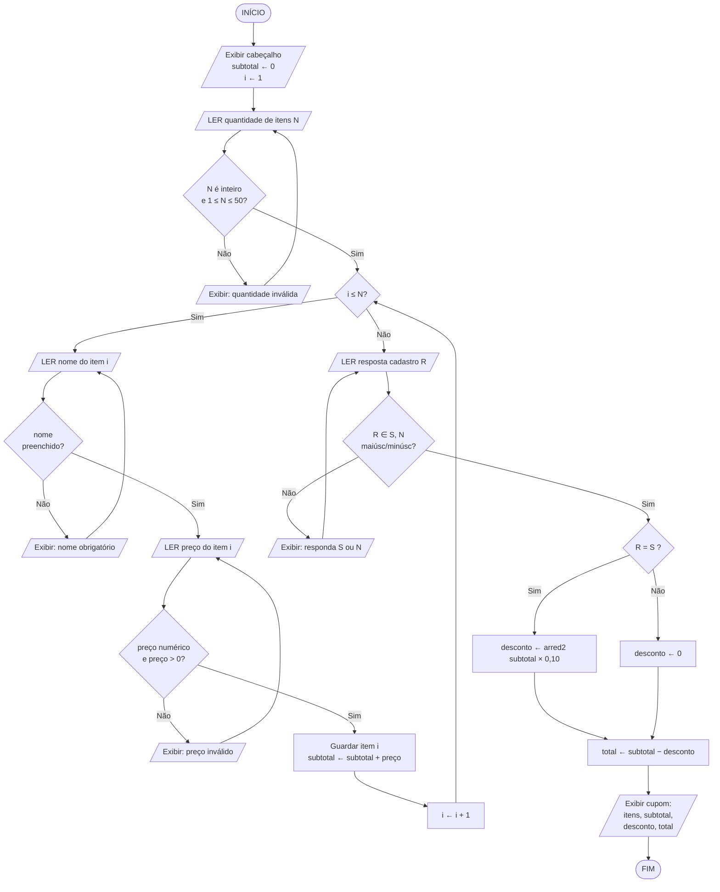
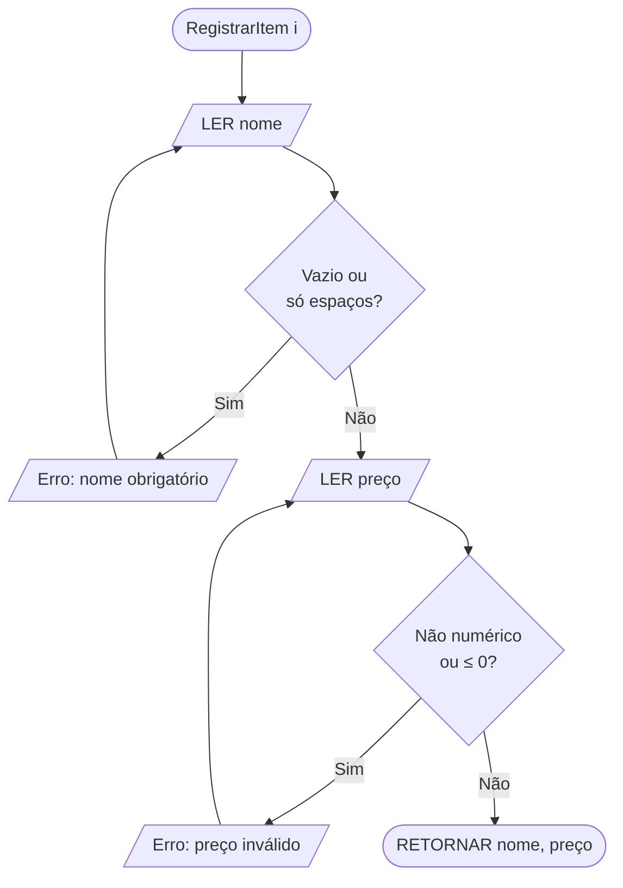

# Simulador de Pedidos — Cafeteria (Atendimento no Balcão)

Documento de projeto do algoritmo: regras de negócio, descrição em linguagem natural,
fluxograma, casos de teste, tabela de decisão e pseudocódigo modularizado.

---

## 1. Escopo do problema

O atendente registra, no balcão, o pedido de **um cliente por execução**:

1. Informa **quantos itens** o cliente vai pedir.
2. Para **cada item**, informa **nome** e **preço**.
3. Ao final, informa se o cliente é **cadastrado**.
4. Se for cadastrado, o sistema aplica **10% de desconto**; caso contrário, cobra o **valor cheio**.
5. O sistema exibe o **cupom** com subtotal, desconto e total.

Fora de escopo (não pedido): meios de pagamento, estoque, persistência, múltiplos clientes
na mesma execução, quantidade por item (cada item registrado equivale a 1 unidade).

---

## 2. Regras de negócio

| ID | Regra | Tratamento quando violada |
|----|-------|---------------------------|
| **RN01** | A quantidade de itens deve ser um número **inteiro**. | Rejeita e solicita novamente. |
| **RN02** | A quantidade de itens deve estar no intervalo **1 ≤ N ≤ 50** (limite operacional de balcão, evita erro de digitação). | Rejeita, exibe mensagem e solicita novamente. |
| **RN03** | O **nome do item** é obrigatório: não pode ser vazio nem conter apenas espaços. | Rejeita e solicita novamente o nome do **mesmo** item. |
| **RN04** | O **preço do item** deve ser numérico e **estritamente maior que zero** (`preço > 0`). Não há itens gratuitos nem preço negativo. | Rejeita e solicita novamente o preço do **mesmo** item. |
| **RN05** | O **subtotal** é a soma dos preços de todos os itens registrados: `subtotal = Σ preço(i)`. | — |
| **RN06** | A resposta sobre cadastro aceita apenas **S** ou **N**, **sem distinção de maiúsculas/minúsculas** e ignorando espaços nas bordas. | Rejeita e repete a pergunta. |
| **RN07** | Cliente **cadastrado** ⇒ `desconto = subtotal × 10%`. Cliente **não cadastrado** ⇒ `desconto = 0`. | — |
| **RN08** | O `total = subtotal − desconto`. | — |
| **RN09** | Todo valor monetário é **arredondado para 2 casas decimais** com arredondamento comercial (*half-up*: 1,005 → 1,01). O arredondamento é aplicado ao **desconto**, e o total é calculado a partir do desconto já arredondado — assim `subtotal`, `desconto` e `total` sempre fecham entre si. | — |
| **RN10** | Nenhuma entrada inválida **aborta** o pedido: o sistema sempre repete a solicitação até receber um valor válido. | — |
| **RN11** | O total exibido **nunca é negativo** e nunca é maior que o subtotal (garantido por RN04 + RN07). | — |
| **RN12** | Todos os valores são exibidos no formato **`R$ 0,00`** (duas casas decimais, sempre). | — |

**Constantes do sistema**

| Constante | Valor | Origem |
|-----------|-------|--------|
| `TAXA_DESCONTO` | `0,10` (10%) | Política comercial para clientes cadastrados |
| `MIN_ITENS` | `1` | RN02 |
| `MAX_ITENS` | `50` | RN02 |

---

## 3. Solução em linguagem natural

> **Início.** O sistema exibe a saudação de abertura do atendimento e zera o subtotal do pedido.
>
> **Passo 1 — Quantidade de itens.** O sistema pergunta ao atendente quantos itens o cliente vai
> pedir. Se a resposta não for um número inteiro, ou for menor que 1, ou maior que 50, o sistema
> avisa que a quantidade é inválida e **pergunta de novo**, quantas vezes for necessário, até
> receber um valor válido.
>
> **Passo 2 — Registro dos itens.** Com a quantidade válida em mãos, o sistema repete o
> procedimento abaixo uma vez para cada item, do primeiro até o último:
>
> - Pergunta o **nome** do item. Se o nome vier vazio (ou só com espaços), avisa e pergunta de
>   novo o nome desse mesmo item.
> - Pergunta o **preço** do item. Se o preço não for um número, ou for zero, ou for negativo,
>   avisa e pergunta de novo o preço desse mesmo item.
> - Guarda o nome e o preço na lista do pedido e **soma o preço ao subtotal**.
>
> **Passo 3 — Cadastro do cliente.** Terminado o registro, o sistema pergunta se o cliente é
> cadastrado, esperando **S** (sim) ou **N** (não). Maiúsculas e minúsculas são equivalentes.
> Qualquer outra resposta é rejeitada e a pergunta é repetida.
>
> **Passo 4 — Cálculo.** Se o cliente for cadastrado, o sistema calcula o desconto como 10% do
> subtotal, arredondado para duas casas decimais, e o total como subtotal menos desconto.
> Se o cliente **não** for cadastrado, o desconto é zero e o total é igual ao subtotal
> (valor cheio).
>
> **Passo 5 — Cupom.** O sistema exibe a lista de itens com seus preços, o subtotal, o desconto
> aplicado (indicando se houve ou não o benefício de cliente cadastrado) e o valor total a pagar,
> todos no formato monetário com duas casas decimais.
>
> **Fim.**

---

## 4. Fluxograma

### 4.1 Fluxo principal



### 4.2 Sub-rotina `RegistrarItem(i)` — detalhamento do processo predefinido



**Legenda dos símbolos usados** — `([ ])` terminal (início/fim) · `[/ /]` entrada/saída
(paralelogramo) · `[ ]` processo (retângulo) · `{ }` decisão (losango).

---

## 5. Doze casos de exemplo

Convenções: valores em R$; “—” = não aplicável; entradas rejeitadas aparecem em ordem
cronológica, seguidas da entrada válida que as substituiu.

| # | Cenário | Entradas | Subtotal | Desconto | **Total** | Saída/comportamento esperado |
|---|---------|----------|----------|----------|-----------|------------------------------|
| **CT01** | Caminho feliz — não cadastrado, 1 item | N=1; "Café expresso" 5,00; cadastro=**N** | 5,00 | 0,00 | **5,00** | Cupom com valor cheio, sem linha de desconto aplicado. |
| **CT02** | Caminho feliz — cadastrado, 3 itens | N=3; "Cappuccino" 9,50; "Pão de queijo" 6,00; "Suco de laranja" 8,00; cadastro=**S** | 23,50 | 2,35 | **21,15** | Cupom com desconto de 10% destacado. |
| **CT03** | Quantidade zero (RN02) | N=**0** → rejeitado → N=2; "Café" 5,00; "Bolo de cenoura" 7,50; cadastro=**N** | 12,50 | 0,00 | **12,50** | Mensagem “quantidade inválida”, repete a pergunta e prossegue normalmente. |
| **CT04** | Quantidade não inteira (RN01) | N=**2,5** → rejeitado → N=1; "Latte" 11,00; cadastro=**S** | 11,00 | 1,10 | **9,90** | Rejeita valor fracionário, repergunta, aplica desconto. |
| **CT05** | Preço negativo (RN04) | N=2; "Água" **−3,00** → rejeitado → 4,00; "Croissant" 12,00; cadastro=**S** | 16,00 | 1,60 | **14,40** | Rejeita apenas o preço; o nome já lido **não** é solicitado de novo. |
| **CT06** | Preço zero (RN04) | N=1; "Espresso" **0,00** → rejeitado → 3,50; cadastro=**N** | 3,50 | 0,00 | **3,50** | Zero é inválido (não existe item gratuito). |
| **CT07** | Nome vazio (RN03) | N=1; nome=**""** → rejeitado → "Chá de hortelã" 7,00; cadastro=**S** | 7,00 | 0,70 | **6,30** | Rejeita nome em branco e repete a leitura do nome. |
| **CT08** | Resposta de cadastro inválida (RN06) | N=2; "Mocha" 13,90; "Cookie" 6,10; cadastro=**"X"** → rejeitado → **S** | 20,00 | 2,00 | **18,00** | Mensagem “responda S ou N”, repete a pergunta. |
| **CT09** | Resposta minúscula (RN06) | N=1; "Café coado" 6,00; cadastro=**"s"** | 6,00 | 0,60 | **5,40** | Aceita minúscula como equivalente a “S”. |
| **CT10** | Recusa explícita de desconto | N=2; "Torta de limão" 15,00; "Café" 5,00; cadastro=**"n"** | 20,00 | 0,00 | **20,00** | Valor cheio, desconto zerado. |
| **CT11** | Arredondamento *half-up* (RN09) | N=2; "Pingado" 4,55; "Sonho" 5,50; cadastro=**S** | 10,05 | **1,01** | **9,04** | 10,05 × 0,10 = 1,005 → arredonda para 1,01; total fecha em 9,04. |
| **CT12** | Limite máximo + pedido grande (RN02) | N=**51** → rejeitado → N=5; 45,00; 38,50; 52,80; 29,00; 22,00; cadastro=**S** | 187,30 | 18,73 | **168,57** | Rejeita quantidade acima de 50, repergunta e processa o pedido grande. |

**Cobertura:** CT01/CT02/CT10 (fluxos principais) · CT03/CT04/CT12 (RN01, RN02) ·
CT07 (RN03) · CT05/CT06 (RN04) · CT08/CT09 (RN06) · CT02/CT11 (RN07, RN09) ·
CT03–CT08/CT12 (RN10 — nenhuma entrada inválida aborta o pedido).

---

## 6. Tabela de decisão

### 6.1 Tabela principal (entradas limitadas)

**Condições**

- **C1** — Quantidade informada é inteiro e está em [1, 50]? *(RN01, RN02)*
- **C2** — Item corrente tem nome preenchido **e** preço numérico > 0? *(RN03, RN04)*
- **C3** — Resposta sobre cadastro ∈ {S, s, N, n}? *(RN06)*
- **C4** — Resposta sobre cadastro é afirmativa (S/s)? *(RN07)*

**Ações**

- **A1** — Exibir erro de quantidade e reler a quantidade
- **A2** — Exibir erro do item e reler o campo inválido do **mesmo** item
- **A3** — Exibir erro e repetir a pergunta de cadastro
- **A4** — `desconto ← arred2(subtotal × 0,10)`
- **A5** — `desconto ← 0`
- **A6** — `total ← subtotal − desconto`
- **A7** — Exibir cupom e encerrar

| Condição \ Regra | **R1** | **R2** | **R3** | **R4** | **R5** |
|------------------|:------:|:------:|:------:|:------:|:------:|
| C1 — quantidade válida | **N** | S | S | S | S |
| C2 — item válido | – | **N** | S | S | S |
| C3 — resposta S/N válida | – | – | **N** | S | S |
| C4 — cliente cadastrado | – | – | – | **S** | **N** |
| **Ações** | | | | | |
| A1 — reler quantidade | **X** | | | | |
| A2 — reler campo do item | | **X** | | | |
| A3 — repetir pergunta cadastro | | | **X** | | |
| A4 — desconto = 10% | | | | **X** | |
| A5 — desconto = 0 | | | | | **X** |
| A6 — total = subtotal − desconto | | | | **X** | **X** |
| A7 — exibir cupom / encerrar | | | | **X** | **X** |

`S` = verdadeiro · `N` = falso · `–` = indiferente (condição ainda não avaliada no fluxo) ·
`X` = ação executada.

> **Leitura das regras:** R1 a R3 são **regras de validação** — não avançam o fluxo, apenas
> repetem a leitura correspondente (RN10). R4 e R5 são as **regras de conclusão**, mutuamente
> exclusivas e coletivamente exaustivas: todo pedido válido termina em exatamente uma delas.

### 6.2 Tabela auxiliar — validação de campo do item (detalhe de C2)

| Situação do campo | Nome vazio/só espaços | Preço não numérico | Preço ≤ 0 | Ação |
|-------------------|:---------------------:|:------------------:|:---------:|------|
| **R2.1** | **S** | – | – | Erro “nome obrigatório” → reler **nome** |
| **R2.2** | N | **S** | – | Erro “preço inválido” → reler **preço** |
| **R2.3** | N | N | **S** | Erro “preço deve ser maior que zero” → reler **preço** |
| **R2.4** | N | N | N | Aceitar item, acumular no subtotal |

---

## 7. Pseudocódigo modularizado

Notação: Portugol. Parâmetros com `var` são passados **por referência**; os demais, por valor.

```
// =====================================================================
//  ALGORITMO SimuladorDePedidosCafeteria
// =====================================================================
ALGORITMO SimuladorDePedidosCafeteria

// ---------------------------------------------------------------------
//  CONSTANTES
// ---------------------------------------------------------------------
CONST
    TAXA_DESCONTO : real     = 0.10     // RN07 — 10% para cliente cadastrado
    MIN_ITENS     : inteiro  = 1        // RN02
    MAX_ITENS     : inteiro  = 50       // RN02

// ---------------------------------------------------------------------
//  VARIÁVEIS GLOBAIS DO PROGRAMA PRINCIPAL
// ---------------------------------------------------------------------
VAR
    nomes      : vetor[1..MAX_ITENS] de caractere
    precos     : vetor[1..MAX_ITENS] de real
    qtdItens   : inteiro
    subtotal   : real
    desconto   : real
    total      : real
    cadastrado : logico


// =====================================================================
//  MÓDULOS UTILITÁRIOS
// =====================================================================

// Arredondamento comercial (half-up) para 2 casas decimais — RN09
FUNCAO Arredondar2 (valor : real) : real
INICIO
    RETORNE PISO(valor * 100 + 0.5) / 100
FIM

// Formatação monetária "R$ 0,00" — RN12
FUNCAO FormatarMoeda (valor : real) : caractere
INICIO
    RETORNE "R$ " + FORMATAR(valor, 2, ",")   // sempre 2 casas decimais
FIM


// =====================================================================
//  MÓDULOS DE ENTRADA (leem e validam — RN10: nunca abortam)
// =====================================================================

// Lê a quantidade de itens — RN01, RN02
FUNCAO LerQuantidadeItens () : inteiro
VAR
    entrada : caractere
    n       : inteiro
    valido  : logico
INICIO
    valido <- FALSO
    REPITA
        ESCREVA "Quantos itens o cliente vai pedir? "
        LEIA entrada

        SE NAO EhInteiro(entrada) ENTAO
            ESCREVA "[ERRO] Informe um numero inteiro."
        SENAO
            n <- ParaInteiro(entrada)
            SE (n < MIN_ITENS) OU (n > MAX_ITENS) ENTAO
                ESCREVA "[ERRO] A quantidade deve estar entre ",
                        MIN_ITENS, " e ", MAX_ITENS, "."
            SENAO
                valido <- VERDADEIRO
            FIM_SE
        FIM_SE
    ATE valido

    RETORNE n
FIM

// Lê o nome de um item — RN03
FUNCAO LerNomeItem (indice : inteiro) : caractere
VAR
    nome : caractere
INICIO
    REPITA
        ESCREVA "Item ", indice, " - nome: "
        LEIA nome
        nome <- SemEspacosNasBordas(nome)

        SE COMPRIMENTO(nome) = 0 ENTAO
            ESCREVA "[ERRO] O nome do item e obrigatorio."
        FIM_SE
    ATE COMPRIMENTO(nome) > 0

    RETORNE nome
FIM

// Lê o preço de um item — RN04
FUNCAO LerPrecoItem (indice : inteiro; nome : caractere) : real
VAR
    entrada : caractere
    preco   : real
    valido  : logico
INICIO
    valido <- FALSO
    REPITA
        ESCREVA "Item ", indice, " (", nome, ") - preco: R$ "
        LEIA entrada

        SE NAO EhNumero(entrada) ENTAO
            ESCREVA "[ERRO] Informe um valor numerico."
        SENAO
            preco <- ParaReal(entrada)
            SE preco <= 0 ENTAO
                ESCREVA "[ERRO] O preco deve ser maior que zero."
            SENAO
                valido <- VERDADEIRO
            FIM_SE
        FIM_SE
    ATE valido

    RETORNE preco
FIM

// Lê a resposta sobre cadastro — RN06
FUNCAO LerClienteCadastrado () : logico
VAR
    resposta : caractere
INICIO
    REPITA
        ESCREVA "O cliente e cadastrado? (S/N): "
        LEIA resposta
        resposta <- MAIUSCULA(SemEspacosNasBordas(resposta))

        SE (resposta <> "S") E (resposta <> "N") ENTAO
            ESCREVA "[ERRO] Responda apenas S (sim) ou N (nao)."
        FIM_SE
    ATE (resposta = "S") OU (resposta = "N")

    RETORNE (resposta = "S")
FIM


// =====================================================================
//  MÓDULO DE REGISTRO DO PEDIDO
// =====================================================================

// Registra os N itens e devolve o subtotal — RN05
FUNCAO RegistrarPedido (qtd    : inteiro;
                    VAR nomes  : vetor[1..MAX_ITENS] de caractere;
                    VAR precos : vetor[1..MAX_ITENS] de real) : real
VAR
    i    : inteiro
    soma : real
INICIO
    soma <- 0

    PARA i DE 1 ATE qtd FACA
        nomes[i]  <- LerNomeItem(i)
        precos[i] <- LerPrecoItem(i, nomes[i])
        soma      <- soma + precos[i]
    FIM_PARA

    RETORNE Arredondar2(soma)
FIM


// =====================================================================
//  MÓDULOS DE CÁLCULO (regras de negócio puras — sem E/S)
// =====================================================================

// Desconto de 10% apenas para cliente cadastrado — RN07, RN09
FUNCAO CalcularDesconto (subtotal : real; cadastrado : logico) : real
INICIO
    SE cadastrado ENTAO
        RETORNE Arredondar2(subtotal * TAXA_DESCONTO)
    SENAO
        RETORNE 0
    FIM_SE
FIM

// Total a pagar — RN08, RN11
FUNCAO CalcularTotal (subtotal : real; desconto : real) : real
INICIO
    RETORNE Arredondar2(subtotal - desconto)
FIM


// =====================================================================
//  MÓDULOS DE SAÍDA
// =====================================================================

PROCEDIMENTO ExibirCabecalho ()
INICIO
    ESCREVA "======================================="
    ESCREVA "   CAFETERIA - ATENDIMENTO NO BALCAO   "
    ESCREVA "======================================="
FIM

PROCEDIMENTO ExibirCupom (qtd        : inteiro;
                          nomes      : vetor[1..MAX_ITENS] de caractere;
                          precos     : vetor[1..MAX_ITENS] de real;
                          subtotal   : real;
                          desconto   : real;
                          total      : real;
                          cadastrado : logico)
VAR
    i : inteiro
INICIO
    ESCREVA "---------------------------------------"
    ESCREVA "                CUPOM                  "
    ESCREVA "---------------------------------------"

    PARA i DE 1 ATE qtd FACA
        ESCREVA i, ") ", nomes[i], " .......... ", FormatarMoeda(precos[i])
    FIM_PARA

    ESCREVA "---------------------------------------"
    ESCREVA "Subtotal ................ ", FormatarMoeda(subtotal)

    SE cadastrado ENTAO
        ESCREVA "Cliente cadastrado: desconto de 10%"
        ESCREVA "Desconto ................ -", FormatarMoeda(desconto)
    SENAO
        ESCREVA "Cliente nao cadastrado: sem desconto"
    FIM_SE

    ESCREVA "---------------------------------------"
    ESCREVA "TOTAL A PAGAR ........... ", FormatarMoeda(total)
    ESCREVA "======================================="
FIM


// =====================================================================
//  PROGRAMA PRINCIPAL
// =====================================================================
INICIO
    ExibirCabecalho()

    qtdItens   <- LerQuantidadeItens()                          // Passo 1
    subtotal   <- RegistrarPedido(qtdItens, nomes, precos)      // Passo 2
    cadastrado <- LerClienteCadastrado()                        // Passo 3

    desconto   <- CalcularDesconto(subtotal, cadastrado)        // Passo 4
    total      <- CalcularTotal(subtotal, desconto)

    ExibirCupom(qtdItens, nomes, precos,                        // Passo 5
                subtotal, desconto, total, cadastrado)
FIM
```

### 7.1 Mapa de módulos

| Módulo | Tipo | Responsabilidade | Regras cobertas |
|--------|------|------------------|-----------------|
| `Arredondar2` | Função | Arredondamento comercial em 2 casas | RN09 |
| `FormatarMoeda` | Função | Formatação `R$ 0,00` | RN12 |
| `LerQuantidadeItens` | Função | Ler e validar N | RN01, RN02, RN10 |
| `LerNomeItem` | Função | Ler e validar nome | RN03, RN10 |
| `LerPrecoItem` | Função | Ler e validar preço | RN04, RN10 |
| `LerClienteCadastrado` | Função | Ler e validar S/N | RN06, RN10 |
| `RegistrarPedido` | Função | Laço dos itens + subtotal | RN05 |
| `CalcularDesconto` | Função | Aplicar (ou não) os 10% | RN07, RN09 |
| `CalcularTotal` | Função | Subtotal − desconto | RN08, RN11 |
| `ExibirCabecalho` | Procedimento | Abertura do atendimento | — |
| `ExibirCupom` | Procedimento | Saída formatada | RN12 |
| **Principal** | — | Orquestração dos 5 passos | — |

> **Critério de modularização adotado:** separação entre **entrada validada**, **regra de negócio
> pura** e **saída**. As funções `CalcularDesconto` e `CalcularTotal` não fazem leitura nem
> escrita — dependem apenas dos parâmetros —, o que as torna diretamente testáveis pelos casos
> CT01–CT12 sem simular o teclado.
